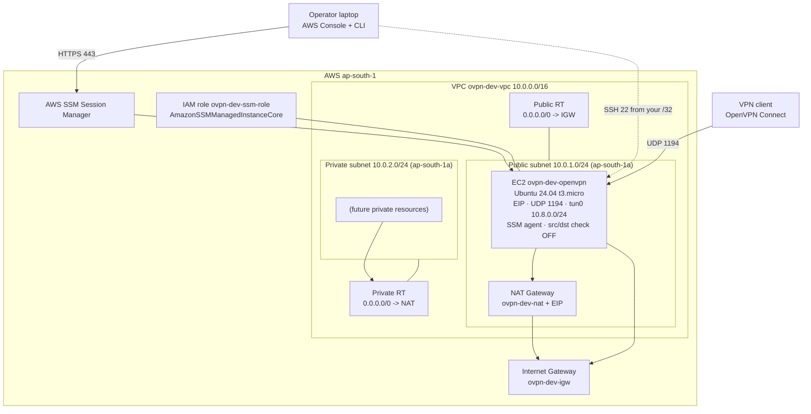
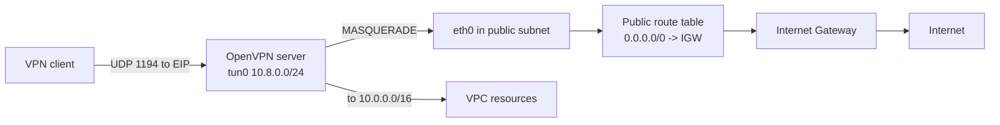
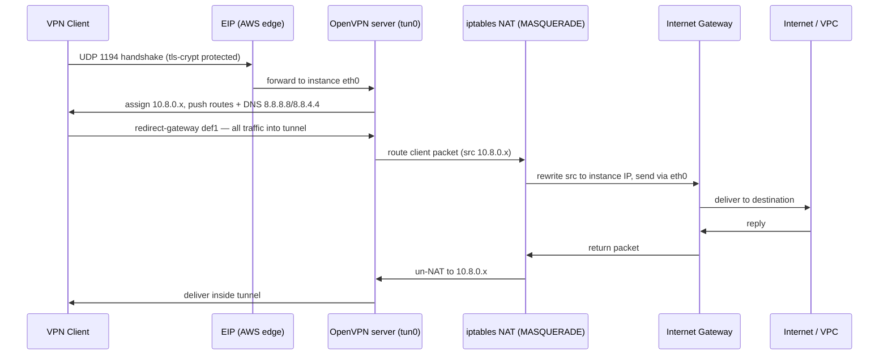

# AWS Manual OpenVPN Deployment

A click-by-click, copy-paste-ready guide that reproduces **by hand** the exact OpenVPN-on-AWS
environment that the Terraform (`../iac/terraform/`) and Ansible (`../iac/ansible/`) automation in
this repository builds. Every IP range, port, AMI filter, security-group rule, IAM policy, and
OpenVPN setting below is taken directly from the repository source — nothing is invented.

> For the automated version, see [`../iac/`](../iac/). This guide is the manual mirror of it.

---

## Overview

This lab runs **OpenVPN Community Edition** (open-source) on a single Ubuntu 24.04 EC2 instance in a
custom VPC, in AWS region **`ap-south-1`** (Mumbai). The server lives in a **public subnet** with an
**Elastic IP**, accepts VPN clients on **UDP 1194**, hands them addresses from the **`10.8.0.0/24`**
tunnel subnet, and **NATs** their traffic out to the internet. A **private subnet** with a **NAT
Gateway** is created to model a realistic public+private VPC (it currently holds no workloads).

Management is done two ways, exactly as the automation intends:

- **AWS SSM Session Manager** — primary. No inbound SSH needed; the instance has an IAM role with
  `AmazonSSMManagedInstanceCore`. This is how the Ansible automation connects.
- **SSH** — break-glass only, locked to **your single public IP** (`/32`), using an EC2 key pair.

> **IMPORTANT — there is no OpenVPN "Admin UI" / "Web UI".** This repository uses **OpenVPN Community
> Edition**, not OpenVPN Access Server. There is no web console, no `https://<ip>:943/admin` page,
> and no `openvpn-as` package. Everything is done from a **terminal on the server**: `apt install
> openvpn easy-rsa`, an Easy-RSA PKI, a templated `server.conf`, the `openvpn-server@server` systemd
> unit, kernel IP forwarding, and an iptables `MASQUERADE` rule. The "Initial Setup Wizard" section
> below is therefore a sequence of terminal commands, not a GUI wizard. See **[Assumptions](#assumptions)**.

### What this guide deliberately matches

| Item | Value (from repo) |
|---|---|
| Region | `ap-south-1` |
| Availability Zone | `ap-south-1a` |
| VPC CIDR | `10.0.0.0/16` |
| Public subnet | `10.0.1.0/24` |
| Private subnet | `10.0.2.0/24` |
| VPN client (tunnel) subnet | `10.8.0.0/24` |
| Instance type | `t3.micro` |
| AMI | latest Canonical Ubuntu **24.04 (Noble)** `amd64` HVM SSD |
| Root volume | `gp3`, **8 GiB** |
| Key pair name | `ovpn-admin` |
| OpenVPN port/proto/dev | **UDP 1194**, `tun` |
| Cipher / auth | `AES-256-GCM` / `SHA256` |
| tls-crypt | yes (`tls-crypt.key`) |
| DNS pushed to clients | `8.8.8.8`, `8.8.4.4` |
| Default client name | `admin_user` |

---

## Architecture

The automation's resource naming uses the prefix `ovpn-dev` (`project_name = ovpn`,
`environment = dev`). This guide uses the same names so a manual build is indistinguishable from the
Terraform one.

```
   Your laptop (operator)                          AWS  (ap-south-1)
 ┌──────────────────────────┐               ┌────────────────────────────────────────┐
 │ AWS Console + terminal   │               │  VPC ovpn-dev-vpc  10.0.0.0/16          │
 │ aws ssm start-session ───┼── HTTPS 443 ──▶│  ┌──────────── public 10.0.1.0/24 ───┐ │
 │ scp/console of .ovpn  ◀──┼───────────────┼─▶│ OpenVPN EC2 (Ubuntu 24.04, t3.micro)│ │
 │ ovpn-admin.pem (SSH) ····┼··· TCP 22 ····┼··│  EIP · UDP 1194 · SSM agent         │ │
 │ (your IP /32 only)       │               │  │  tun0 10.8.0.0/24 · MASQUERADE      │ │
 └──────────────────────────┘               │  └───────────────────┬────────────────┘ │
                                            │  IGW ◀─ public RT     │ NAT GW (private) │
                                            │  ┌─────────── private 10.0.2.0/24 ──┐    │
                                            │  │ (future private resources)   ────┼──▶ │
                                            │  └──────────────────────────────────┘    │
                                            └────────────────────────────────────────-─┘
   VPN clients ── UDP 1194 ─▶ EIP ─▶ OpenVPN ─▶ tun 10.8.0.0/24 ─▶ NAT/MASQUERADE ─▶ internet
```

---

## What The Automated Deployment Creates

The manual steps below reproduce exactly this resource set (built by `../iac/terraform/main.tf` and
configured by `../iac/ansible/`):

**Terraform (infrastructure):**

- VPC `10.0.0.0/16` with DNS support + DNS hostnames enabled.
- Public subnet `10.0.1.0/24` in `ap-south-1a`, **auto-assign public IP = on**.
- Private subnet `10.0.2.0/24` in `ap-south-1a` (no auto-assign public IP).
- Internet Gateway, attached to the VPC.
- Elastic IP for NAT + a NAT Gateway in the **public** subnet.
- Public route table (`0.0.0.0/0` → IGW) associated to the public subnet.
- Private route table (`0.0.0.0/0` → NAT GW) associated to the private subnet.
- Security group `ovpn-dev-openvpn-sg`: inbound UDP 1194 from anywhere, inbound TCP 22 from your
  `/32`, all outbound.
- Security group `ovpn-dev-private-sg`: inbound all-from-VPC + all-from-VPN-clients, all outbound.
- Latest Canonical Ubuntu 24.04 AMI lookup.
- S3 bucket `<account-id>-ovpn-ssm-transfer` (public access fully blocked) — used only by the
  Ansible `aws_ssm` file-transfer plugin. **In a manual build you can skip this bucket** (you'll move
  the `.ovpn` file with `scp` or by copy/paste instead). See [Assumptions](#assumptions).
- IAM role `ovpn-dev-ssm-role` + instance profile `ovpn-dev-ssm-profile` with
  `AmazonSSMManagedInstanceCore` plus a scoped S3 policy for the transfer bucket.
- Auto-generated RSA-4096 key pair named `ovpn-admin` (private key saved locally as
  `ovpn-admin.pem`, `chmod 600`).
- EC2 `t3.micro` Ubuntu 24.04, in the public subnet, **source/dest check disabled**, gp3 8 GiB root,
  the SSM instance profile, `user_data` that just starts the SSM agent.
- Elastic IP attached to the instance.

**Ansible (OpenVPN configuration on the box):**

- `apt install openvpn easy-rsa iptables-persistent`.
- Easy-RSA PKI (ECDSA `prime256v1`, 3650-day CA + cert expiry, batch mode): `init-pki`, `build-ca
  nopass`, `build-server-full server nopass`.
- `openvpn --genkey secret tls-crypt.key`.
- `/etc/openvpn/server/server.conf` from the template.
- IP forwarding enabled (sysctl, persistent).
- iptables NAT `POSTROUTING MASQUERADE` for `10.8.0.0/24` out the primary interface, made persistent.
- `openvpn-server@server` systemd service enabled + started.
- Default client `admin_user` certificate built and a complete `admin_user.ovpn` rendered and
  downloaded.

---

## Prerequisites

On your laptop / operator machine:

- An AWS account with permissions to create VPC, EC2, IAM, and (optionally) S3 resources. The
  automation assumes an admin-equivalent operator in region `ap-south-1`.
- **AWS CLI v2** configured for `ap-south-1`.
- The **Session Manager plugin** for the AWS CLI (for `aws ssm start-session`).
- An **OpenVPN client** to test the tunnel: *OpenVPN Connect* (Windows/macOS/iOS/Android) or the
  `openvpn` CLI on Linux.

```bash
# Verify your tooling and identity (region must be ap-south-1)
aws --version
aws sts get-caller-identity
aws configure get region          # should print: ap-south-1

# Confirm the Session Manager plugin is installed
session-manager-plugin --version
```

Find your **current public IP** — you'll lock SSH to exactly this address (the automation detects it
via `checkip.amazonaws.com`):

```bash
# This is the same source Terraform uses (data.http.my_public_ip)
curl -s https://checkip.amazonaws.com
# Use the printed value as <YOUR_IP> and the SSH rule CIDR as <YOUR_IP>/32
```

> If your public IP later changes (new network, ISP, travel), you must **edit the SSH inbound rule**
> to your new `/32`. SSM access is unaffected by IP changes.

---

## Architecture Diagram

### 1. High-Level Architecture (graph TD)



### 2. Network Flow (graph LR)



### 3. OpenVPN Traffic Flow (sequenceDiagram)



---

## Phase 1 - AWS Networking

> Throughout this phase, make sure the AWS Console region selector (top-right) reads **Asia Pacific
> (Mumbai) `ap-south-1`**. All resources must be in this region and, for subnets, in AZ
> **`ap-south-1a`**.

### Create VPC

**Purpose:** The private network (`10.0.0.0/16`) that contains every resource in this lab. Matches
`aws_vpc.this`.

**AWS Console Navigation:** VPC → *Your VPCs* → **Create VPC**.

**Configuration Values:**

| Field | Value |
|---|---|
| Resources to create | **VPC only** (we build subnets/IGW/NAT manually for learning) |
| Name tag | `ovpn-dev-vpc` |
| IPv4 CIDR | `10.0.0.0/16` |
| IPv6 CIDR | No IPv6 CIDR block |
| Tenancy | Default |
| DNS hostnames | **Enabled** |
| DNS resolution (DNS support) | **Enabled** |

**Step-by-Step Procedure:**

1. Open the VPC console and choose **Create VPC**.
2. Select **VPC only**.
3. Set **Name tag** to `ovpn-dev-vpc`.
4. Enter **IPv4 CIDR** `10.0.0.0/16`. Leave IPv6 as *No IPv6 CIDR block*. Tenancy: *Default*.
5. Click **Create VPC**.
6. Select the new VPC → **Actions → Edit VPC settings** → tick **Enable DNS hostnames** (DNS
   resolution is on by default). Save.


**Expected Result:** A VPC named `ovpn-dev-vpc` with CIDR `10.0.0.0/16`, DNS support and DNS
hostnames both enabled, in `ap-south-1`.

**Validation:**

```bash
aws ec2 describe-vpcs --region ap-south-1 \
  --filters Name=tag:Name,Values=ovpn-dev-vpc \
  --query 'Vpcs[0].{CIDR:CidrBlock,DnsSupport:EnableDnsSupport,VpcId:VpcId}'
```

- [ ] VPC `ovpn-dev-vpc` exists with CIDR `10.0.0.0/16`.
- [ ] DNS hostnames and DNS resolution are both **enabled**.

### Create Public Subnet

**Purpose:** Holds the OpenVPN EC2 and the NAT Gateway; gets public IPs and a route to the IGW.
Matches `aws_subnet.public`.

**AWS Console Navigation:** VPC → *Subnets* → **Create subnet**.

**Configuration Values:**

| Field | Value |
|---|---|
| VPC | `ovpn-dev-vpc` |
| Name tag | `ovpn-dev-public-subnet` |
| Availability Zone | `ap-south-1a` |
| IPv4 CIDR | `10.0.1.0/24` |
| Auto-assign public IPv4 | **Enabled** |

**Step-by-Step Procedure:**

1. **Create subnet** → select VPC `ovpn-dev-vpc`.
2. Name `ovpn-dev-public-subnet`; AZ `ap-south-1a`; CIDR `10.0.1.0/24`. Create.
3. Select the subnet → **Actions → Edit subnet settings** → tick **Enable auto-assign public IPv4
   address**. Save.


**Expected Result:** `ovpn-dev-public-subnet` (`10.0.1.0/24`, `ap-south-1a`) with auto-assign public
IPv4 enabled.

**Validation:**

```bash
aws ec2 describe-subnets --region ap-south-1 \
  --filters Name=tag:Name,Values=ovpn-dev-public-subnet \
  --query 'Subnets[0].{CIDR:CidrBlock,AZ:AvailabilityZone,PublicIP:MapPublicIpOnLaunch}'
```

- [ ] Subnet `10.0.1.0/24` in `ap-south-1a`.
- [ ] `MapPublicIpOnLaunch = true`.

### Create Private Subnet

**Purpose:** For future protected workloads; reaches the internet only via the NAT Gateway. Matches
`aws_subnet.private`.

**AWS Console Navigation:** VPC → *Subnets* → **Create subnet**.

**Configuration Values:**

| Field | Value |
|---|---|
| VPC | `ovpn-dev-vpc` |
| Name tag | `ovpn-dev-private-subnet` |
| Availability Zone | `ap-south-1a` |
| IPv4 CIDR | `10.0.2.0/24` |
| Auto-assign public IPv4 | **Disabled** (default) |

**Step-by-Step Procedure:**

1. **Create subnet** → VPC `ovpn-dev-vpc`.
2. Name `ovpn-dev-private-subnet`; AZ `ap-south-1a`; CIDR `10.0.2.0/24`. Create.
3. Leave auto-assign public IPv4 **disabled**.


**Expected Result:** `ovpn-dev-private-subnet` (`10.0.2.0/24`, `ap-south-1a`), no public IPs.

**Validation:**

```bash
aws ec2 describe-subnets --region ap-south-1 \
  --filters Name=tag:Name,Values=ovpn-dev-private-subnet \
  --query 'Subnets[0].{CIDR:CidrBlock,AZ:AvailabilityZone,PublicIP:MapPublicIpOnLaunch}'
```

- [ ] Subnet `10.0.2.0/24` in `ap-south-1a`.
- [ ] `MapPublicIpOnLaunch = false`.

### Create Internet Gateway

**Purpose:** Gives the public subnet (and the NAT Gateway) a path to the internet. Matches
`aws_internet_gateway.this`.

**AWS Console Navigation:** VPC → *Internet gateways* → **Create internet gateway**.

**Configuration Values:**

| Field | Value |
|---|---|
| Name tag | `ovpn-dev-igw` |

**Step-by-Step Procedure:**

1. **Create internet gateway**, name it `ovpn-dev-igw`, click **Create**.


**Expected Result:** An IGW `ovpn-dev-igw` in state **Detached** (we attach it next).

**Validation:**

```bash
aws ec2 describe-internet-gateways --region ap-south-1 \
  --filters Name=tag:Name,Values=ovpn-dev-igw \
  --query 'InternetGateways[0].InternetGatewayId'
```

- [ ] IGW `ovpn-dev-igw` exists.

### Attach Internet Gateway

**Purpose:** Bind the IGW to the VPC so it can route traffic.

**AWS Console Navigation:** VPC → *Internet gateways* → select `ovpn-dev-igw` → **Actions → Attach to
VPC**.

**Configuration Values:**

| Field | Value |
|---|---|
| Available VPC | `ovpn-dev-vpc` |

**Step-by-Step Procedure:**

1. Select `ovpn-dev-igw` → **Actions → Attach to VPC**.
2. Choose `ovpn-dev-vpc` → **Attach internet gateway**.


**Expected Result:** IGW state becomes **Attached** to `ovpn-dev-vpc`.

**Validation:**

```bash
aws ec2 describe-internet-gateways --region ap-south-1 \
  --filters Name=tag:Name,Values=ovpn-dev-igw \
  --query 'InternetGateways[0].Attachments[0].{VpcId:VpcId,State:State}'
```

- [ ] IGW attachment `State = available` to the correct VPC.

### Create NAT Gateway

**Purpose:** Outbound-only internet for the **private** subnet. Lives in the **public** subnet and
needs its own Elastic IP. Matches `aws_eip.nat` + `aws_nat_gateway.this`.

> **Cost note:** the NAT Gateway + its EIP is the dominant cost (~$45/mo). It exists only to model a
> realistic public+private VPC and serves the (currently empty) private subnet. For a VPN-only lab
> you may skip it — but to faithfully reproduce the automation, create it. See
> [Cost / cleanup](#appendix).

**AWS Console Navigation:** VPC → *NAT gateways* → **Create NAT gateway**.

**Configuration Values:**

| Field | Value |
|---|---|
| Name | `ovpn-dev-nat` |
| Subnet | `ovpn-dev-public-subnet` (10.0.1.0/24) |
| Connectivity type | Public |
| Elastic IP | **Allocate Elastic IP** (tag it `ovpn-dev-nat-eip`) |

**Step-by-Step Procedure:**

1. **Create NAT gateway**. Name `ovpn-dev-nat`.
2. **Subnet:** select `ovpn-dev-public-subnet`. (The NAT GW must sit in the public subnet.)
3. **Connectivity type:** Public.
4. Click **Allocate Elastic IP**. (Optionally tag that EIP `ovpn-dev-nat-eip`.)
5. **Create NAT gateway**. Wait until **State = Available** (1–3 minutes).


**Expected Result:** `ovpn-dev-nat` is **Available** in the public subnet with an allocated Elastic
IP.

**Validation:**

```bash
aws ec2 describe-nat-gateways --region ap-south-1 \
  --filter Name=tag:Name,Values=ovpn-dev-nat \
  --query 'NatGateways[0].{State:State,Subnet:SubnetId}'
```

- [ ] NAT Gateway `ovpn-dev-nat` is **available** and in the public subnet.

### Configure Route Tables

**Purpose:** Two route tables — public (default route to IGW) and private (default route to NAT GW)
— each associated to its subnet. Matches `aws_route_table.public/private` and their associations.

**AWS Console Navigation:** VPC → *Route tables*.

**Configuration Values:**

| Route table | Name | Route | Associated subnet |
|---|---|---|---|
| Public | `ovpn-dev-public-rt` | `0.0.0.0/0` → `ovpn-dev-igw` | `ovpn-dev-public-subnet` |
| Private | `ovpn-dev-private-rt` | `0.0.0.0/0` → `ovpn-dev-nat` | `ovpn-dev-private-subnet` |

**Step-by-Step Procedure:**

1. **Create route table** → name `ovpn-dev-public-rt`, VPC `ovpn-dev-vpc`. Create.
2. Select it → **Routes → Edit routes → Add route**: Destination `0.0.0.0/0`, Target **Internet
   Gateway → `ovpn-dev-igw`**. Save.
3. **Subnet associations → Edit subnet associations** → tick `ovpn-dev-public-subnet`. Save.
4. **Create route table** → name `ovpn-dev-private-rt`, VPC `ovpn-dev-vpc`. Create.
5. Select it → **Routes → Edit routes → Add route**: Destination `0.0.0.0/0`, Target **NAT Gateway →
   `ovpn-dev-nat`**. Save.
6. **Subnet associations → Edit subnet associations** → tick `ovpn-dev-private-subnet`. Save.


**Expected Result:** Public subnet routes `0.0.0.0/0` to the IGW; private subnet routes `0.0.0.0/0`
to the NAT GW; local route `10.0.0.0/16` exists on both (automatic).

**Validation:**

```bash
# Public RT should target the IGW for 0.0.0.0/0
aws ec2 describe-route-tables --region ap-south-1 \
  --filters Name=tag:Name,Values=ovpn-dev-public-rt \
  --query 'RouteTables[0].Routes[?DestinationCidrBlock==`0.0.0.0/0`]'

# Private RT should target the NAT GW for 0.0.0.0/0
aws ec2 describe-route-tables --region ap-south-1 \
  --filters Name=tag:Name,Values=ovpn-dev-private-rt \
  --query 'RouteTables[0].Routes[?DestinationCidrBlock==`0.0.0.0/0`]'
```

- [ ] Public RT: `0.0.0.0/0` → IGW; associated to the public subnet.
- [ ] Private RT: `0.0.0.0/0` → NAT GW; associated to the private subnet.

### Validate Networking

```bash
aws ec2 describe-vpcs --region ap-south-1 --filters Name=tag:Name,Values=ovpn-dev-vpc \
  --query 'Vpcs[0].VpcId'
aws ec2 describe-subnets --region ap-south-1 --filters Name=vpc-id,Values=<VPC_ID> \
  --query 'Subnets[].{Name:Tags[?Key==`Name`]|[0].Value,CIDR:CidrBlock,AZ:AvailabilityZone}'
aws ec2 describe-nat-gateways --region ap-south-1 \
  --filter Name=tag:Name,Values=ovpn-dev-nat --query 'NatGateways[0].State'
```

## Validation

- [ ] VPC `10.0.0.0/16` with DNS support + hostnames.
- [ ] Public subnet `10.0.1.0/24` (`ap-south-1a`, auto-assign public IPv4 on).
- [ ] Private subnet `10.0.2.0/24` (`ap-south-1a`, no public IPv4).
- [ ] IGW attached to the VPC.
- [ ] NAT Gateway available in the public subnet with an EIP.
- [ ] Public RT → IGW (associated to public subnet); Private RT → NAT (associated to private subnet).

---

## Phase 2 - Security

### Create Security Group

**Purpose:** The OpenVPN host's firewall. Management is via SSM, so **no inbound SSH is strictly
required** — but break-glass SSH is allowed from your IP only. Matches `aws_security_group.openvpn`.
We also create the private SG (`aws_security_group.private`).

**AWS Console Navigation:** EC2 → *Network & Security → Security Groups* → **Create security group**.

**Configuration Values (OpenVPN SG):**

| Field | Value |
|---|---|
| Security group name | `ovpn-dev-openvpn-sg` |
| Description | `OpenVPN host. Management is via AWS SSM (no inbound SSH required).` |
| VPC | `ovpn-dev-vpc` |

**Step-by-Step Procedure:**

1. **Create security group**. Name `ovpn-dev-openvpn-sg`, set the description above, VPC
   `ovpn-dev-vpc`.
2. Add the inbound/outbound rules in the next two sections.
3. Click **Create security group**.


**Expected Result:** A security group `ovpn-dev-openvpn-sg` in `ovpn-dev-vpc`.

### Configure Inbound Rules

**Purpose:** Allow VPN clients (UDP 1194 from anywhere) and break-glass SSH (TCP 22 from **your IP
only**).

**Configuration Values (exact, from `aws_security_group.openvpn` ingress):**

| Type | Protocol | Port | Source | Description |
|---|---|---|---|---|
| Custom UDP | UDP | `1194` | `0.0.0.0/0` | `OpenVPN UDP 1194` |
| SSH | TCP | `22` | `<YOUR_IP>/32` | `SSH (break-glass) from your detected public IP` |

**Step-by-Step Procedure:**

1. In the SG's **Inbound rules → Add rule**: Type *Custom UDP*, Port `1194`, Source `0.0.0.0/0`.
2. **Add rule**: Type *SSH*, Port `22`, Source `<YOUR_IP>/32` (the value from
   `curl -s https://checkip.amazonaws.com`, with `/32` appended). **Never use `0.0.0.0/0` for SSH.**


**Expected Result:** Exactly two inbound rules: UDP 1194 from `0.0.0.0/0`, TCP 22 from your `/32`.

### Configure Outbound Rules

**Purpose:** Allow all egress — the SSM agent needs HTTPS 443 to AWS and OpenVPN needs to reach the
internet. Matches `aws_security_group.openvpn` egress.

**Configuration Values:**

| Type | Protocol | Port range | Destination | Description |
|---|---|---|---|---|
| All traffic | All (`-1`) | All | `0.0.0.0/0` | `All outbound` |

**Step-by-Step Procedure:**

1. In **Outbound rules**, keep/add a single rule: Type *All traffic*, Destination `0.0.0.0/0`.


**Expected Result:** One outbound rule allowing all traffic to `0.0.0.0/0`.

#### Private security group (`ovpn-dev-private-sg`)

Create a second SG to match `aws_security_group.private` (used by future private-subnet workloads):

| Direction | Type | Protocol | Source/Dest | Description |
|---|---|---|---|---|
| Inbound | All traffic | All (`-1`) | `10.0.0.0/16` | `From inside the VPC` |
| Inbound | All traffic | All (`-1`) | `10.8.0.0/24` | `From VPN clients` |
| Outbound | All traffic | All (`-1`) | `0.0.0.0/0` | `All outbound` |

**Step-by-Step Procedure:**

1. **Create security group** → name `ovpn-dev-private-sg`, description `Private resources: reachable
   from the VPC and from VPN clients.`, VPC `ovpn-dev-vpc`.
2. Add the two inbound rules (source `10.0.0.0/16`, then `10.8.0.0/24`) and the single all-outbound
   rule. Create.

### Validate Security

```bash
aws ec2 describe-security-groups --region ap-south-1 \
  --filters Name=group-name,Values=ovpn-dev-openvpn-sg \
  --query 'SecurityGroups[0].{In:IpPermissions,Out:IpPermissionsEgress}'
```

## Validation

- [ ] `ovpn-dev-openvpn-sg`: inbound UDP 1194 from `0.0.0.0/0`.
- [ ] `ovpn-dev-openvpn-sg`: inbound TCP 22 from your `/32` only (**not** `0.0.0.0/0`).
- [ ] `ovpn-dev-openvpn-sg`: outbound all to `0.0.0.0/0`.
- [ ] `ovpn-dev-private-sg`: inbound all-from-`10.0.0.0/16` + all-from-`10.8.0.0/24`; outbound all.

---

## Phase 3 - EC2

### Launch Instance

**Purpose:** The OpenVPN server. Ubuntu 24.04, `t3.micro`, in the **public** subnet, with the SSM
instance profile and source/dest check disabled. Matches `aws_instance.openvpn`.

**AWS Console Navigation:** EC2 → *Instances* → **Launch instances**.

**Configuration Values:**

| Field | Value |
|---|---|
| Name | `ovpn-dev-openvpn` |
| AMI | Latest **Ubuntu Server 24.04 LTS (Noble)**, `amd64` (Canonical, owner `099720109477`) |
| Instance type | `t3.micro` |
| Key pair | `ovpn-admin` (created in [Configure Key Pair](#configure-key-pair)) |
| VPC | `ovpn-dev-vpc` |
| Subnet | `ovpn-dev-public-subnet` |
| Auto-assign public IP | Enable (an Elastic IP is attached later anyway) |
| Security group | `ovpn-dev-openvpn-sg` |
| IAM instance profile | `ovpn-dev-ssm-profile` (see [Configure IAM Role](#configure-iam-role)) |

The Terraform AMI lookup is, exactly:

```
owners      = ["099720109477"]                                        # Canonical
name filter = "ubuntu/images/hvm-ssd*/ubuntu-noble-24.04-amd64-server-*"
virtualization-type = hvm
architecture        = x86_64
most_recent = true
```

**User data** (matches the instance `user_data` — it only ensures the SSM agent runs; it does **not**
install OpenVPN):

```bash
#!/bin/bash
set -eux
snap start amazon-ssm-agent || systemctl restart amazon-ssm-agent || true
```

**Step-by-Step Procedure:**

1. **Launch instances** → Name `ovpn-dev-openvpn`.
2. **AMI:** search the AWS Marketplace/Quick Start for *Ubuntu Server 24.04 LTS*, architecture
   `64-bit (x86)`. Confirm the owner is **Canonical (099720109477)**. (To pin the newest matching
   AMI explicitly, use the CLI snippet below.)
3. **Instance type:** `t3.micro`.
4. **Key pair:** select `ovpn-admin`.
5. **Network settings → Edit:** VPC `ovpn-dev-vpc`, Subnet `ovpn-dev-public-subnet`, Auto-assign
   public IP **Enable**, Firewall **Select existing security group** → `ovpn-dev-openvpn-sg`.
6. **Advanced details → IAM instance profile:** `ovpn-dev-ssm-profile`. Paste the user-data above
   into **User data**.
7. Configure storage (next section), then **Launch instance**.

To resolve the exact AMI id the automation would pick:

```bash
aws ec2 describe-images --region ap-south-1 --owners 099720109477 \
  --filters "Name=name,Values=ubuntu/images/hvm-ssd*/ubuntu-noble-24.04-amd64-server-*" \
            "Name=virtualization-type,Values=hvm" \
            "Name=architecture,Values=x86_64" \
  --query 'sort_by(Images,&CreationDate)[-1].{AMI:ImageId,Name:Name}'
```


**Expected Result:** A pending/running instance `ovpn-dev-openvpn`, Ubuntu 24.04, `t3.micro`, in the
public subnet.

### Configure Storage

**Purpose:** Match the root volume: **gp3, 8 GiB**. Matches `aws_instance.openvpn.root_block_device`.

**Configuration Values:**

| Field | Value |
|---|---|
| Volume type | `gp3` |
| Size | `8` GiB |
| Delete on termination | Yes (default) |

**Step-by-Step Procedure:**

1. In **Configure storage**, set the root volume to **8 GiB**, type **gp3**.


**Expected Result:** One 8 GiB gp3 root volume.

### Configure Key Pair

**Purpose:** Break-glass SSH. The automation **generates** an RSA-4096 key pair named `ovpn-admin`
and saves the private key locally as `ovpn-admin.pem` (chmod 600). Matches `tls_private_key.ovpn_admin`
+ `aws_key_pair.ovpn_admin`.

**AWS Console Navigation:** EC2 → *Network & Security → Key Pairs* → **Create key pair**.

**Configuration Values:**

| Field | Value |
|---|---|
| Name | `ovpn-admin` |
| Type | RSA |
| Private key format | `.pem` |

**Step-by-Step Procedure (Option A — console-generated key):**

1. **Create key pair** → Name `ovpn-admin`, Type **RSA**, format **.pem**. Create.
2. The browser downloads `ovpn-admin.pem`. Move it somewhere safe and lock its permissions:

```bash
mv ~/Downloads/ovpn-admin.pem ./ovpn-admin.pem
chmod 600 ./ovpn-admin.pem
```

**Step-by-Step Procedure (Option B — reproduce Terraform exactly: RSA-4096 generated locally):**

The automation generates **RSA 4096-bit** and imports only the public key. To mirror that:

```bash
# Generate a 4096-bit RSA key locally (private stays on your machine as ovpn-admin.pem)
ssh-keygen -t rsa -b 4096 -f ./ovpn-admin.pem -N "" -C "ovpn-admin"
chmod 600 ./ovpn-admin.pem

# Import ONLY the public key into AWS as a key pair named ovpn-admin
aws ec2 import-key-pair --region ap-south-1 \
  --key-name ovpn-admin \
  --public-key-material fileb://./ovpn-admin.pem.pub
```

> `ovpn-admin.pem` is a secret. The repo `.gitignore` excludes `*.pem` — never commit it.


**Expected Result:** An EC2 key pair named `ovpn-admin`; the private key saved locally as
`ovpn-admin.pem` with `0600` permissions.

### Configure IAM Role

**Purpose:** Let the instance register with SSM (primary access path) and use the optional S3
transfer bucket. Matches `aws_iam_role.ssm` + `aws_iam_instance_profile.ssm` + the two policies.

**AWS Console Navigation:** IAM → *Roles* → **Create role**.

**Configuration Values:**

| Field | Value |
|---|---|
| Trusted entity | AWS service → **EC2** |
| Role name | `ovpn-dev-ssm-role` |
| Managed policy | `AmazonSSMManagedInstanceCore` |
| Inline policy name | `ovpn-dev-ssm-s3` |
| Instance profile name | `ovpn-dev-ssm-profile` |

The trust policy (matches `data.aws_iam_policy_document.ssm_assume`):

```json
{
  "Version": "2012-10-17",
  "Statement": [
    {
      "Effect": "Allow",
      "Action": "sts:AssumeRole",
      "Principal": { "Service": "ec2.amazonaws.com" }
    }
  ]
}
```

The inline S3 policy (matches `data.aws_iam_policy_document.ssm_s3`; replace
`<SSM_TRANSFER_BUCKET>` with `<account-id>-ovpn-ssm-transfer`):

```json
{
  "Version": "2012-10-17",
  "Statement": [
    {
      "Effect": "Allow",
      "Action": ["s3:GetObject", "s3:PutObject", "s3:DeleteObject"],
      "Resource": "arn:aws:s3:::<SSM_TRANSFER_BUCKET>/*"
    },
    {
      "Effect": "Allow",
      "Action": ["s3:ListBucket", "s3:GetBucketLocation"],
      "Resource": "arn:aws:s3:::<SSM_TRANSFER_BUCKET>"
    }
  ]
}
```

**Step-by-Step Procedure:**

1. IAM → **Create role** → Trusted entity **AWS service → EC2**.
2. Attach the **AWS managed policy `AmazonSSMManagedInstanceCore`**.
3. Name the role `ovpn-dev-ssm-role` → Create.
4. Open the role → **Add permissions → Create inline policy** → JSON → paste the S3 policy above
   (only needed if you create the optional S3 bucket) → name it `ovpn-dev-ssm-s3` → Create.
5. The console auto-creates an instance profile with the role's name. To match the automation's
   profile name `ovpn-dev-ssm-profile`, create it explicitly via CLI if needed:

```bash
aws iam create-instance-profile --instance-profile-name ovpn-dev-ssm-profile
aws iam add-role-to-instance-profile \
  --instance-profile-name ovpn-dev-ssm-profile --role-name ovpn-dev-ssm-role
```

6. Back in the EC2 launch (or **Instance → Actions → Security → Modify IAM role**), attach
   `ovpn-dev-ssm-profile`.

> **(Optional) S3 transfer bucket** — only needed to mirror the Ansible `aws_ssm` file-transfer path.
> A manual reader can skip this and move the `.ovpn` with `scp`/copy-paste instead.
>
> ```bash
> ACCOUNT_ID=$(aws sts get-caller-identity --query Account --output text)
> aws s3api create-bucket --bucket "${ACCOUNT_ID}-ovpn-ssm-transfer" --region ap-south-1 \
>   --create-bucket-configuration LocationConstraint=ap-south-1
> aws s3api put-public-access-block --bucket "${ACCOUNT_ID}-ovpn-ssm-transfer" \
>   --public-access-block-configuration \
>   BlockPublicAcls=true,IgnorePublicAcls=true,BlockPublicPolicy=true,RestrictPublicBuckets=true
> ```


**Expected Result:** Role `ovpn-dev-ssm-role` with `AmazonSSMManagedInstanceCore` (+ optional S3
inline policy), exposed via instance profile `ovpn-dev-ssm-profile`, attached to the instance.

### Assign Elastic IP

**Purpose:** A stable public endpoint clients connect to. Matches `aws_eip.openvpn`.

**AWS Console Navigation:** EC2 → *Network & Security → Elastic IPs* → **Allocate Elastic IP address**.

**Configuration Values:**

| Field | Value |
|---|---|
| Name tag | `ovpn-dev-openvpn-eip` |
| Associated instance | `ovpn-dev-openvpn` |

**Step-by-Step Procedure:**

1. **Allocate Elastic IP address** (Amazon pool) → Allocate. Tag it `ovpn-dev-openvpn-eip`.
2. Select it → **Actions → Associate Elastic IP address** → Resource type *Instance* →
   `ovpn-dev-openvpn` → Associate.
3. Record the public IP — this is `<EIP>`, the value clients put in `remote`.


**Expected Result:** The instance has a fixed public Elastic IP.

#### Disable source/destination check (required for VPN NAT)

The instance forwards/NATs traffic that is **not** addressed to itself, so AWS must stop dropping
those packets. Matches `source_dest_check = false`.

**Step-by-Step Procedure:**

1. EC2 → Instances → select `ovpn-dev-openvpn` → **Actions → Networking → Change source/destination
   check** → **Stop** (uncheck "Enable"). Save.

```bash
INSTANCE_ID=$(aws ec2 describe-instances --region ap-south-1 \
  --filters Name=tag:Name,Values=ovpn-dev-openvpn Name=instance-state-name,Values=running \
  --query 'Reservations[0].Instances[0].InstanceId' --output text)
aws ec2 modify-instance-attribute --region ap-south-1 \
  --instance-id "$INSTANCE_ID" --no-source-dest-check
```

### Validate EC2

```bash
aws ec2 describe-instances --region ap-south-1 \
  --filters Name=tag:Name,Values=ovpn-dev-openvpn \
  --query 'Reservations[0].Instances[0].{State:State.Name,Type:InstanceType,SrcDst:SourceDestCheck,
           Subnet:SubnetId,IAM:IamInstanceProfile.Arn,PubIP:PublicIpAddress}'
# SSM should list the instance as Online (wait 1-3 min after launch)
aws ssm describe-instance-information --region ap-south-1 \
  --query "InstanceInformationList[?InstanceId=='$INSTANCE_ID'].PingStatus"
```

## Validation

- [ ] Instance `ovpn-dev-openvpn` is **running**, `t3.micro`, Ubuntu 24.04, in the public subnet.
- [ ] Root volume is **gp3, 8 GiB**.
- [ ] Key pair `ovpn-admin` attached; `ovpn-admin.pem` saved locally `0600`.
- [ ] Instance profile `ovpn-dev-ssm-profile` attached; SSM `PingStatus = Online`.
- [ ] **Source/dest check is disabled.**
- [ ] Elastic IP `ovpn-dev-openvpn-eip` associated; note `<EIP>`.

---

## Phase 4 - OpenVPN Installation

Everything in this phase runs **on the server**, as root, in a terminal. These commands mirror the
Ansible role (`../iac/ansible/roles/openvpn/tasks/main.yml`) **exactly**.

> Reminder: this is **OpenVPN Community Edition** — there is **no web UI**. The "wizard" is the
> Easy-RSA PKI sequence below.

### Connect To Server

**Primary — AWS SSM Session Manager (no open ports, matches the IAM role):**

```bash
INSTANCE_ID=$(aws ec2 describe-instances --region ap-south-1 \
  --filters Name=tag:Name,Values=ovpn-dev-openvpn Name=instance-state-name,Values=running \
  --query 'Reservations[0].Instances[0].InstanceId' --output text)

aws ssm start-session --target "$INSTANCE_ID" --region ap-south-1
# You land as ssm-user; become root for all OpenVPN work:
sudo -i
```

**Break-glass — SSH (only from your `/32`, only if your network allows outbound TCP 22):**

```bash
EIP=$(aws ec2 describe-instances --region ap-south-1 \
  --filters Name=tag:Name,Values=ovpn-dev-openvpn Name=instance-state-name,Values=running \
  --query 'Reservations[0].Instances[0].PublicIpAddress' --output text)

ssh -i ./ovpn-admin.pem ubuntu@"$EIP"
sudo -i
```


**Validation:**

- [ ] You have a **root** shell on `ovpn-dev-openvpn` (via SSM or SSH).

### Install OpenVPN

**Purpose:** Install OpenVPN + Easy-RSA and create the directories. Mirrors the *Install OpenVPN and
Easy-RSA* and *Ensure server + log directories exist* tasks.

```bash
apt-get update
apt-get install -y openvpn easy-rsa

# Server + log directories (mode 0750)
install -d -m 0750 /etc/openvpn/server
install -d -m 0750 /var/log/openvpn
```

**Validation:**

- [ ] `openvpn --version` works; `/etc/openvpn/server` and `/var/log/openvpn` exist.

### Initial Setup Wizard

> **This is NOT a GUI.** It is the Easy-RSA PKI setup — the open-source equivalent of an "initial
> setup". Mirrors *Create Easy-RSA working directory*, *Configure Easy-RSA*, *Initialise the PKI*,
> *Build the CA*, *Build the server certificate*, and *Generate the tls-crypt key*.

**Purpose:** Create the certificate authority, the server certificate/key, and the tls-crypt key.

**Configuration Values (exact, from the role):**

| Setting | Value |
|---|---|
| Easy-RSA dir | `/etc/openvpn/easy-rsa` |
| PKI dir | `/etc/openvpn/easy-rsa/pki` |
| Algorithm | `ec` (ECDSA) |
| Curve | `prime256v1` |
| CA expiry / cert expiry | `3650` days each |
| Batch mode | on (`EASYRSA_BATCH=1`) |
| CA common name | `OpenVPN-CA` |
| Server cert name | `server` (built with `nopass`) |
| tls-crypt key | `/etc/openvpn/server/tls-crypt.key` |

```bash
# Easy-RSA working directory
make-cadir /etc/openvpn/easy-rsa
cd /etc/openvpn/easy-rsa

# Easy-RSA vars: ECDSA prime256v1, 10-year CA + certs, batch mode
cat > /etc/openvpn/easy-rsa/vars <<'EOF'
set_var EASYRSA_ALGO ec
set_var EASYRSA_CURVE prime256v1
set_var EASYRSA_CA_EXPIRE 3650
set_var EASYRSA_CERT_EXPIRE 3650
set_var EASYRSA_BATCH 1
EOF

# Initialise PKI, build CA (no passphrase, CN = OpenVPN-CA)
./easyrsa init-pki
EASYRSA_BATCH=1 EASYRSA_REQ_CN="OpenVPN-CA" ./easyrsa build-ca nopass

# Build the server cert/key (no passphrase)
EASYRSA_BATCH=1 ./easyrsa build-server-full server nopass

# Generate the tls-crypt pre-shared key
openvpn --genkey secret /etc/openvpn/server/tls-crypt.key

# Copy CA + server cert/key into the server dir (mode 0600)
install -m 0600 /etc/openvpn/easy-rsa/pki/ca.crt              /etc/openvpn/server/ca.crt
install -m 0600 /etc/openvpn/easy-rsa/pki/issued/server.crt   /etc/openvpn/server/server.crt
install -m 0600 /etc/openvpn/easy-rsa/pki/private/server.key  /etc/openvpn/server/server.key
```


**Validation:**

- [ ] `pki/ca.crt`, `pki/issued/server.crt`, `pki/private/server.key` exist.
- [ ] `/etc/openvpn/server/{ca.crt,server.crt,server.key,tls-crypt.key}` exist (`0600`).

### Configure Networking

**Purpose:** Enable kernel IP forwarding and add the NAT `MASQUERADE` rule, made persistent. Mirrors
*Enable IP forwarding (persistent)*, *Apply IP forwarding immediately*, the iptables-persistent
tasks, and *Add NAT MASQUERADE for VPN client traffic*.

```bash
# Persistent IP forwarding
echo 'net.ipv4.ip_forward = 1' > /etc/sysctl.d/99-openvpn.conf
sysctl --system
sysctl -w net.ipv4.ip_forward=1

# iptables-persistent (preseed to avoid interactive prompts)
echo "iptables-persistent iptables-persistent/autosave_v4 boolean true" | debconf-set-selections
echo "iptables-persistent iptables-persistent/autosave_v6 boolean true" | debconf-set-selections
DEBIAN_FRONTEND=noninteractive apt-get install -y iptables-persistent

# Primary interface (the role uses ansible_default_ipv4.interface)
WAN_IF=$(ip route show default | awk '/default/ {print $5; exit}')
echo "Primary interface: $WAN_IF"

# NAT: MASQUERADE traffic from the VPN client subnet out the primary interface
iptables -t nat -A POSTROUTING -s 10.8.0.0/24 -o "$WAN_IF" -j MASQUERADE

# Persist the rule
netfilter-persistent save
```


**Validation:**

```bash
sysctl net.ipv4.ip_forward              # = 1
iptables -t nat -S POSTROUTING          # shows MASQUERADE for 10.8.0.0/24
```

- [ ] `net.ipv4.ip_forward = 1`.
- [ ] `POSTROUTING` has a MASQUERADE rule for `10.8.0.0/24` out the primary interface.

### Configure Authentication

**Purpose:** Deploy the OpenVPN **server configuration** — the open-source equivalent of
"authentication settings": certificate-based auth (CA + server cert + key), `tls-crypt`, cipher
`AES-256-GCM`, auth `SHA256`. Mirrors *Deploy server.conf*. This is the **exact** rendered template
(`server.conf.j2`) with the repo's default values substituted.

**Configuration Values:**

| Setting | Value |
|---|---|
| port / proto / dev | `1194` / `udp` / `tun` |
| topology | `subnet` |
| server network/netmask | `10.8.0.0` / `255.255.255.0` |
| cipher / auth | `AES-256-GCM` / `SHA256` |
| dh | `none` (ECDSA) |
| user / group | `nobody` / `nogroup` |
| keepalive | `10 120` |

```bash
cat > /etc/openvpn/server/server.conf <<'EOF'
# Managed by Ansible — do not edit by hand.
port 1194
proto udp
dev tun

ca /etc/openvpn/server/ca.crt
cert /etc/openvpn/server/server.crt
key /etc/openvpn/server/server.key
dh none
tls-crypt /etc/openvpn/server/tls-crypt.key

topology subnet
server 10.8.0.0 255.255.255.0
ifconfig-pool-persist /var/log/openvpn/ipp.txt

push "redirect-gateway def1 bypass-dhcp"
push "dhcp-option DNS 8.8.8.8"
push "dhcp-option DNS 8.8.4.4"

keepalive 10 120
cipher AES-256-GCM
auth SHA256
user nobody
group nogroup
persist-key
persist-tun
status /var/log/openvpn/status.log
verb 3
explicit-exit-notify 1
EOF
chmod 0644 /etc/openvpn/server/server.conf
```


**Validation:**

- [ ] `/etc/openvpn/server/server.conf` matches the values above.

### Configure DNS

**Purpose:** Push Google DNS to clients so name resolution works inside the tunnel. These lines are
already part of `server.conf` above (mirrors `openvpn_dns_1`/`openvpn_dns_2` = `8.8.8.8`/`8.8.4.4`,
plus `redirect-gateway def1` to send all client traffic through the VPN):

```text
push "redirect-gateway def1 bypass-dhcp"
push "dhcp-option DNS 8.8.8.8"
push "dhcp-option DNS 8.8.4.4"
```

Now enable and start the service (mirrors *Enable and start the OpenVPN service*):

```bash
systemctl daemon-reload
systemctl enable --now openvpn-server@server
systemctl status openvpn-server@server --no-pager
```


**Validation:**

```bash
systemctl is-active openvpn-server@server          # active
ss -lunp | grep 1194                               # OpenVPN listening on UDP 1194
ip addr show tun0                                  # tun0 with a 10.8.0.x address
```

## Validation

- [ ] `openvpn-server@server` is **active (running)** and **enabled** at boot.
- [ ] UDP **1194** is listening; `tun0` exists with a `10.8.0.x` address.
- [ ] `ip_forward = 1` and MASQUERADE present.
- [ ] `server.conf` uses `AES-256-GCM` / `SHA256` / `tls-crypt` and pushes DNS `8.8.8.8`/`8.8.4.4`.

---

## Phase 5 - VPN Users

The default user the automation creates first is **`admin_user`** (`group_vars/all.yml` +
`roles/openvpn/defaults/main.yml`). The same procedure makes any additional user. Mirrors
`roles/openvpn/tasks/client.yml`.

### Create User

**Purpose:** Build a client certificate and assemble a self-contained `.ovpn`. Mirrors *Build the
client certificate* and the slurp/render steps.

**Configuration Values:** client name `admin_user` (or any `alphanumeric/-/_` name); `nopass`;
inline `<ca>`, `<cert>`, `<key>`, `<tls-crypt>`; `remote <EIP> 1194`; `cipher AES-256-GCM`, `auth
SHA256`, `remote-cert-tls server`.

Run **on the server as root** (`cd /etc/openvpn/easy-rsa` first):

```bash
USER=admin_user        # or: alice, bob, ...
EIP=<EIP>              # the instance's Elastic IP from Phase 3

cd /etc/openvpn/easy-rsa
EASYRSA_BATCH=1 ./easyrsa build-client-full "$USER" nopass

# Assemble the .ovpn exactly like client.ovpn.j2 (inline certs + tls-crypt)
OUT=/etc/openvpn/server/${USER}.ovpn
{
  echo "client"
  echo "dev tun"
  echo "proto udp"
  echo "remote ${EIP} 1194"
  echo "resolv-retry infinite"
  echo "nobind"
  echo "persist-key"
  echo "persist-tun"
  echo "remote-cert-tls server"
  echo "cipher AES-256-GCM"
  echo "auth SHA256"
  echo "verb 3"
  echo "<ca>"
  cat /etc/openvpn/easy-rsa/pki/ca.crt
  echo "</ca>"
  echo "<cert>"
  cat /etc/openvpn/easy-rsa/pki/issued/${USER}.crt
  echo "</cert>"
  echo "<key>"
  cat /etc/openvpn/easy-rsa/pki/private/${USER}.key
  echo "</key>"
  echo "<tls-crypt>"
  cat /etc/openvpn/server/tls-crypt.key
  echo "</tls-crypt>"
} > "$OUT"
chmod 0600 "$OUT"
ls -l "$OUT"
```

> The template embeds the **full** `server.crt`-style block; in practice the inline `<cert>` may
> contain a text header plus the PEM — copying the whole `issued/<user>.crt` (as above) reproduces
> the Ansible `b64decode` of the slurped file.


**Validation:**

- [ ] `pki/issued/<user>.crt` and `pki/private/<user>.key` exist.
- [ ] `/etc/openvpn/server/<user>.ovpn` exists (`0600`) and contains `remote <EIP> 1194` plus all
  four inline blocks.

### Download Profile

**Purpose:** Get the `.ovpn` onto your laptop (`vpn-clients/<user>.ovpn` in the automation). Without
Ansible, use SSM or SSH.

**Option A — over SSM (no open ports):**

```bash
# On the server: print the file, then copy it from your terminal output, OR push to S3:
# (S3 path mirrors the Ansible aws_ssm transfer bucket)
ACCOUNT_ID=$(curl -s http://169.254.169.254/latest/dynamic/instance-identity/document | awk -F'"' '/accountId/{print $4}')
aws s3 cp /etc/openvpn/server/admin_user.ovpn \
  s3://${ACCOUNT_ID}-ovpn-ssm-transfer/admin_user.ovpn --region ap-south-1

# On your laptop:
aws s3 cp s3://${ACCOUNT_ID}-ovpn-ssm-transfer/admin_user.ovpn ./vpn-clients/admin_user.ovpn --region ap-south-1
```

**Option B — over SSH (break-glass):**

```bash
mkdir -p ./vpn-clients
# .ovpn is created as root-only; copy it to ubuntu's home first, then scp it
ssh -i ./ovpn-admin.pem ubuntu@"$EIP" 'sudo cp /etc/openvpn/server/admin_user.ovpn /home/ubuntu/ && sudo chown ubuntu /home/ubuntu/admin_user.ovpn'
scp -i ./ovpn-admin.pem ubuntu@"$EIP":/home/ubuntu/admin_user.ovpn ./vpn-clients/admin_user.ovpn
ssh -i ./ovpn-admin.pem ubuntu@"$EIP" 'rm -f /home/ubuntu/admin_user.ovpn'
```


**Validation:**

- [ ] `./vpn-clients/admin_user.ovpn` exists locally and begins with `client` and contains
  `remote <EIP> 1194`.

### Connect Client

**Purpose:** Import and connect.

- **OpenVPN Connect (Win/macOS/iOS/Android):** import `admin_user.ovpn` → Connect.
- **Linux CLI:**

```bash
sudo openvpn --config ./vpn-clients/admin_user.ovpn
```


**Validation:**

- [ ] Client connects; logs show *Initialization Sequence Completed*.

### Verify Tunnel

```bash
# On the client, after connecting:
curl -s https://checkip.amazonaws.com      # should now show the server's EIP, not your ISP IP
ping -c 3 8.8.8.8                          # internet works through the tunnel
nslookup example.com                       # DNS via pushed 8.8.8.8 / 8.8.4.4

# On the server, confirm the client got a 10.8.0.x lease:
cat /var/log/openvpn/status.log
```


## Validation

- [ ] `admin_user` certificate built; `admin_user.ovpn` assembled and downloaded.
- [ ] Client connects (UDP 1194, tls-crypt) and gets a `10.8.0.x` address.
- [ ] Public IP as seen from the client equals the server **EIP** (full-tunnel via
  `redirect-gateway`).
- [ ] DNS resolves; `ping 8.8.8.8` succeeds (NAT/MASQUERADE working).

---

## Validation Checklist

**Networking**

- [ ] VPC `10.0.0.0/16` (DNS support + hostnames).
- [ ] Public subnet `10.0.1.0/24` (`ap-south-1a`, auto-assign public IPv4).
- [ ] Private subnet `10.0.2.0/24` (`ap-south-1a`).
- [ ] IGW attached; NAT GW available in the public subnet with EIP.
- [ ] Public RT → IGW; Private RT → NAT; correct associations.

**Security**

- [ ] `ovpn-dev-openvpn-sg`: UDP 1194 from `0.0.0.0/0`; TCP 22 from your `/32`; all egress.
- [ ] `ovpn-dev-private-sg`: from-VPC + from-VPN-clients inbound; all egress.

**EC2**

- [ ] `t3.micro` Ubuntu 24.04 in the public subnet; gp3 8 GiB; key pair `ovpn-admin`.
- [ ] Instance profile `ovpn-dev-ssm-profile`; SSM `Online`.
- [ ] **Source/dest check disabled**; Elastic IP attached.

**OpenVPN**

- [ ] PKI built (ECDSA `prime256v1`, 3650-day); tls-crypt key present.
- [ ] `server.conf` (UDP 1194, `AES-256-GCM`/`SHA256`, push DNS `8.8.8.8`/`8.8.4.4`).
- [ ] `ip_forward = 1`; MASQUERADE for `10.8.0.0/24`.
- [ ] `openvpn-server@server` active + enabled; UDP 1194 listening; `tun0` up.

**Client**

- [ ] `admin_user.ovpn` generated, downloaded, imports, connects, full-tunnel + DNS + internet work.

---

## Troubleshooting

### Cannot SSH

- **Diagnostics:** `ssh -v -i ./ovpn-admin.pem ubuntu@<EIP>` hangs/times out.
- **Causes & fix:**
  - Your public IP changed → the SG still allows your old `/32`. Re-check with
    `curl -s https://checkip.amazonaws.com` and update the inbound TCP 22 rule on
    `ovpn-dev-openvpn-sg` to the new `/32`.
  - Your network blocks outbound TCP 22 → **use SSM instead** (`aws ssm start-session`), which needs
    no inbound ports.
  - Wrong key/permissions → `chmod 600 ovpn-admin.pem`; user is `ubuntu` (not `ec2-user`).
  - Instance has no public IP → confirm the **Elastic IP** is associated.

### OpenVPN UI inaccessible (there is none)

- **This is expected.** This deployment is **OpenVPN Community Edition** — it has **no Admin/Web UI**
  (no `:943/admin`, no `openvpn-as`). Manage it from a shell via **SSM** (primary) or **SSH**
  (break-glass). All "settings" live in `/etc/openvpn/server/server.conf`. If you were expecting a
  web console, you're thinking of OpenVPN Access Server, which this repo does not use.

### VPN connected but no internet

- **Diagnostics (on server):**
  ```bash
  sysctl net.ipv4.ip_forward            # must be 1
  iptables -t nat -S POSTROUTING        # must show MASQUERADE for 10.8.0.0/24
  ip route show default                 # confirm the WAN interface name
  ```
- **Fix:** re-apply [Configure Networking](#configure-networking). Also confirm **source/dest check
  is disabled** on the instance (`aws ec2 modify-instance-attribute --no-source-dest-check`) — with
  it enabled, AWS silently drops the NATed packets.

### DNS resolution

- **Diagnostics:** tunnel up, `ping 8.8.8.8` works but names don't resolve.
- **Fix:** ensure `server.conf` has `push "dhcp-option DNS 8.8.8.8"` and `8.8.4.4`; restart
  `openvpn-server@server`. On some clients (split-DNS OSes) set the client to use the pushed DNS.

### Client routing

- **Diagnostics:** only some destinations work, or your real IP still shows.
- **Fix:** `server.conf` must contain `push "redirect-gateway def1 bypass-dhcp"` (full tunnel). After
  connecting, `curl https://checkip.amazonaws.com` from the client should return the server **EIP**.
  To reach VPC resources, the local route `10.0.0.0/16` plus the private SG's `from-VPN-clients` rule
  (`10.8.0.0/24`) must be in place.

### Security-group mistakes

- **Symptom:** client can't reach UDP 1194, or SSM offline.
- **Fix:** `ovpn-dev-openvpn-sg` must allow **inbound UDP 1194 from `0.0.0.0/0`** and **all egress**
  (SSM needs outbound 443). SSH 22 must be your `/32` only. Verify:
  ```bash
  aws ec2 describe-security-groups --region ap-south-1 \
    --filters Name=group-name,Values=ovpn-dev-openvpn-sg --query 'SecurityGroups[0].IpPermissions'
  ```

### Route-table mistakes

- **Symptom:** server can't reach the internet / SSM never comes online.
- **Fix:** the **public** route table must have `0.0.0.0/0 → IGW` and be **associated to the public
  subnet** that holds the instance. The private RT's `0.0.0.0/0 → NAT` must be on the **private**
  subnet only. A common error is associating the NAT route with the public subnet.

### NAT gateway mistakes

- **Symptom:** private-subnet resources have no outbound internet (does not affect VPN clients, which
  egress via the instance's own MASQUERADE).
- **Fix:** NAT GW must be **in the public subnet**, **Available**, with an **EIP**, and referenced by
  the **private** route table's default route. Verify:
  ```bash
  aws ec2 describe-nat-gateways --region ap-south-1 \
    --filter Name=tag:Name,Values=ovpn-dev-nat --query 'NatGateways[0].{State:State,Subnet:SubnetId}'
  ```

### Certificate issues

- **Symptom:** client errors like `TLS handshake failed`, `certificate verify failed`, or
  `tls-crypt unwrap error`.
- **Fix:** the client `.ovpn` must embed the **current** server's `<ca>`, `<cert>`, `<key>`, and the
  **matching `<tls-crypt>`**. If you rebuilt the PKI (`init-pki`/`build-ca`), all old `.ovpn` files
  are invalid — regenerate them ([Phase 5](#phase-5---vpn-users)). Ensure `remote-cert-tls server` is
  present and the CA in the profile matches `pki/ca.crt`.

### User authentication issues

- **Symptom:** a specific user can't connect though others can.
- **Fix:** this lab uses **certificate-only** auth (no username/password). Rebuild that user's cert
  (`./easyrsa build-client-full <user> nopass`) and reassemble their `.ovpn`. Names must be
  alphanumeric / `-` / `_`. If a user's profile leaked, revoke the cert
  (`./easyrsa revoke <user>` + `gen-crl`) and re-issue.

---

## Mapping To Terraform Resources

| Manual Step | Terraform File | Resource |
|---|---|---|
| Create VPC | `main.tf` | `aws_vpc.this` |
| Create Public Subnet | `main.tf` | `aws_subnet.public` |
| Create Private Subnet | `main.tf` | `aws_subnet.private` |
| Create Internet Gateway | `main.tf` | `aws_internet_gateway.this` |
| Attach Internet Gateway | `main.tf` | `aws_internet_gateway.this` (`vpc_id`) |
| Create NAT Gateway (+ EIP) | `main.tf` | `aws_nat_gateway.this`, `aws_eip.nat` |
| Public route table + assoc. | `main.tf` | `aws_route_table.public`, `aws_route_table_association.public` |
| Private route table + assoc. | `main.tf` | `aws_route_table.private`, `aws_route_table_association.private` |
| Create Security Group (OpenVPN) | `main.tf` | `aws_security_group.openvpn` |
| Private Security Group | `main.tf` | `aws_security_group.private` |
| Ubuntu AMI lookup | `main.tf` | `data.aws_ami.ubuntu` |
| S3 transfer bucket (optional) | `main.tf` | `aws_s3_bucket.ssm_transfer`, `aws_s3_bucket_public_access_block.ssm_transfer` |
| IAM role (trust) | `main.tf` | `aws_iam_role.ssm`, `data.aws_iam_policy_document.ssm_assume` |
| SSM managed policy | `main.tf` | `aws_iam_role_policy_attachment.ssm_core` |
| Scoped S3 inline policy | `main.tf` | `aws_iam_role_policy.ssm_s3`, `data.aws_iam_policy_document.ssm_s3` |
| Instance profile | `main.tf` | `aws_iam_instance_profile.ssm` |
| Key pair (RSA-4096) | `main.tf` | `tls_private_key.ovpn_admin`, `aws_key_pair.ovpn_admin`, `local_sensitive_file.ovpn_admin_pem` |
| Launch instance (+ user_data, src/dst, storage) | `main.tf` | `aws_instance.openvpn` |
| Assign Elastic IP | `main.tf` | `aws_eip.openvpn` |
| Detected admin IP for SSH `/32` | `main.tf`, `locals.tf` | `data.http.my_public_ip`, `local.admin_ssh_cidr` |
| Region / CIDRs / AZ / instance type / key name | `variables.tf`, `terraform.tfvars` | input variables |
| Names + tags + bucket name | `locals.tf` | `local.name_prefix`, `local.common_tags`, `local.ssm_transfer_bucket` |
| (Ansible inventory) | `main.tf` | `local_file.ansible_inventory` |

## Mapping To Ansible Roles

| Manual Action | Ansible Task (`roles/openvpn/tasks/*.yml`) |
|---|---|
| `apt install openvpn easy-rsa` | `main.yml` → *Install OpenVPN and Easy-RSA* |
| Create `/etc/openvpn/server` + `/var/log/openvpn` | `main.yml` → *Ensure server + log directories exist* |
| `make-cadir /etc/openvpn/easy-rsa` | `main.yml` → *Create Easy-RSA working directory* |
| Write Easy-RSA `vars` (EC/prime256v1/3650/batch) | `main.yml` → *Configure Easy-RSA (ECDSA, long expiry, batch mode)* |
| `./easyrsa init-pki` | `main.yml` → *Initialise the PKI* |
| `./easyrsa build-ca nopass` (CN `OpenVPN-CA`) | `main.yml` → *Build the CA (no passphrase)* |
| `./easyrsa build-server-full server nopass` | `main.yml` → *Build the server certificate* |
| `openvpn --genkey secret tls-crypt.key` | `main.yml` → *Generate the tls-crypt key* |
| Copy CA/server cert+key into server dir (0600) | `main.yml` → *Copy CA + server cert/key into the server directory* |
| Write `server.conf` | `main.yml` → *Deploy server.conf* (template `server.conf.j2`) |
| `echo net.ipv4.ip_forward=1` + `sysctl --system` | `main.yml` → *Enable IP forwarding (persistent)* (+ handler *reload sysctl*) |
| `sysctl -w net.ipv4.ip_forward=1` | `main.yml` → *Apply IP forwarding immediately* |
| Preseed + install `iptables-persistent` | `main.yml` → *Preseed iptables-persistent* / *Install iptables-persistent* |
| `iptables -t nat -A POSTROUTING -s 10.8.0.0/24 -j MASQUERADE` | `main.yml` → *Add NAT MASQUERADE for VPN client traffic* (+ handler *save iptables*) |
| `systemctl enable --now openvpn-server@server` | `main.yml` → *Enable and start the OpenVPN service* (+ handler *restart openvpn*) |
| Build `admin_user` client + render `.ovpn` | `main.yml` → *Create the default VPN client* → `client.yml` |
| `./easyrsa build-client-full <user> nopass` | `client.yml` → *Build the client certificate* |
| Read ca/cert/key/tls-crypt | `client.yml` → *Read CA / client certificate / client key / tls-crypt key* |
| Assemble `<user>.ovpn` (inline blocks) | `client.yml` → *Render `<user>.ovpn` on the server* (template `client.ovpn.j2`) |
| Download `<user>.ovpn` to `vpn-clients/` | `client.yml` → *Fetch `<user>.ovpn` to vpn-clients/ locally* |
| Create extra users (`-e vpn_user=<name>`) | `create-user.yml` → *Build the client certificate and fetch the profile* |

---

## Assumptions

1. **No OpenVPN web UI exists.** This repo uses **OpenVPN Community Edition** (easy-rsa PKI, a
   templated `server.conf`, the `openvpn-server@server` systemd unit, IP forwarding + iptables
   MASQUERADE), **not** OpenVPN Access Server. There is therefore **no Admin/Web UI**. The "Initial
   Setup Wizard" and "Configure Authentication" sections are documented as **terminal commands** that
   mirror the Ansible role exactly, not a GUI.
2. **Resource names use the `ovpn-dev` prefix.** Terraform names everything `${project_name}-${environment}`
   = `ovpn-dev` (`variables.tf`/`terraform.tfvars`). The manual build reuses these names for parity;
   they are cosmetic and can be changed.
3. **Account-specific values are placeholders.** `<account-id>`, `<EIP>`, `<YOUR_IP>`, `<VPC_ID>`,
   `<SSM_TRANSFER_BUCKET>` (`<account-id>-ovpn-ssm-transfer`) depend on your account/session and are
   resolved by the CLI snippets provided. The repo's S3 backend bucket
   (`123456789123-terraform-s3-backend-for-test-vpc`, key `ovpn/terraform.tfstate`) is **Terraform
   state only** and is **not** part of the runtime VPN — a manual build has no Terraform state, so it
   is intentionally omitted.
4. **Admin IP is detected, not hardcoded.** Terraform locks SSH to your `/32` via
   `data.http.my_public_ip` (`checkip.amazonaws.com`). Manually, you fetch it the same way and must
   update the SG when it changes.
5. **SSH key:** Terraform generates an **RSA-4096** key and saves `ovpn-admin.pem`. The manual guide
   offers a console-generated RSA key (Option A) or the exact RSA-4096 reproduction via
   `ssh-keygen`/`import-key-pair` (Option B). Both yield a key pair named `ovpn-admin`.
6. **S3 transfer bucket is optional manually.** It exists in Terraform solely so the Ansible `aws_ssm`
   plugin can move files without SSH/SCP. A manual reader can skip it and use `scp` or copy/paste; if
   you keep it, attach the scoped IAM S3 policy so the instance can read/write it.
7. **`.ovpn` assembly.** The Ansible template base64-decodes slurped files into inline `<ca>`,
   `<cert>`, `<key>`, `<tls-crypt>` blocks. The manual `cat`-based assembly reproduces this; copying
   the **whole** `issued/<user>.crt` file (header + PEM) matches the template's decoded content.
8. **`userdata.sh` is unrelated.** The standalone Apache "dashboard" `user_data` script in
   `../extras/userdata.sh` is a separate EC2 learning artifact and is **not** used by this VPN. The
   VPN instance's real user data only starts the SSM agent (shown in Phase 3).
9. **Single AZ, single instance.** The design is intentionally single-AZ (`ap-south-1a`) and
   single-instance for simplicity; no HA/redundancy is reproduced.

## Appendix

### A. Quick value reference (copy-paste targets)

```text
Region:               ap-south-1        AZ: ap-south-1a
VPC:                  10.0.0.0/16       (ovpn-dev-vpc)
Public subnet:        10.0.1.0/24       (ovpn-dev-public-subnet)
Private subnet:       10.0.2.0/24       (ovpn-dev-private-subnet)
VPN client subnet:    10.8.0.0/24       (server 10.8.0.0 255.255.255.0)
Instance:             t3.micro, Ubuntu 24.04 (Canonical 099720109477), gp3 8 GiB
Key pair:             ovpn-admin  (private key -> ovpn-admin.pem, chmod 600)
OpenVPN:              UDP 1194, dev tun, topology subnet
Crypto:               cipher AES-256-GCM, auth SHA256, tls-crypt, dh none (ECDSA prime256v1)
Pushed DNS:           8.8.8.8, 8.8.4.4   (+ redirect-gateway def1 bypass-dhcp)
Default client:       admin_user
SG (openvpn):         in UDP 1194 0.0.0.0/0 | in TCP 22 <your-ip>/32 | out all
SG (private):         in all from 10.0.0.0/16 + 10.8.0.0/24 | out all
IAM:                  role ovpn-dev-ssm-role + AmazonSSMManagedInstanceCore (+ scoped S3)
                      instance profile ovpn-dev-ssm-profile
Service:              openvpn-server@server (enabled + started)
```

### B. Server health one-liners (run on the box)

```bash
systemctl is-active openvpn-server@server
ss -lunp | grep 1194
sysctl net.ipv4.ip_forward
iptables -t nat -S POSTROUTING | grep MASQUERADE
ip addr show tun0
cat /var/log/openvpn/status.log
journalctl -u openvpn-server@server -n 50 --no-pager
```

### C. Cost and cleanup

Approximate monthly cost in `ap-south-1` (matches `../iac/README.md`):

| Resource | ~Cost/mo | Required for VPN? |
|---|---|---|
| NAT Gateway + its EIP | **~$45** | **No** — serves only the empty private subnet |
| EC2 `t3.micro` | ~$7.5 (free-tier yr 1) | Yes |
| Elastic IP (server) | ~$3.6 | Yes |
| EBS gp3 8 GiB | ~$0.64 | Yes |
| S3 transfer bucket | cents | Optional |

**Biggest saving (~$45/mo):** skip/delete the NAT Gateway + its EIP + the private route — the VPN
host lives in the public subnet and doesn't need them. **Always tear everything down when finished**
to stop billing (especially idle Elastic IPs and the NAT Gateway). Manual teardown order: disconnect
clients → terminate the instance → release both Elastic IPs → delete NAT Gateway → detach/delete IGW
→ delete subnets, route tables, security groups → delete the VPC → delete the IAM role/instance
profile and (optional) S3 bucket → delete the `ovpn-admin` key pair.

```bash
# Confirm nothing bills after cleanup
aws ec2 describe-addresses --region ap-south-1 --query 'length(Addresses)'                       # 0
aws ec2 describe-nat-gateways --region ap-south-1 \
  --filter Name=state,Values=available --query 'length(NatGateways)'                             # 0
```

### D. Differences vs the automation (intentional)

- No Terraform state / S3 backend (manual build has no state to store).
- The S3 transfer bucket and the Ansible-generated `inventory.ini` are automation plumbing; the
  manual `.ovpn` download uses `scp`/S3/console instead.
- The automation re-detects your IP and rebuilds keys on each `apply`; manually you edit the SG and
  reuse the same `ovpn-admin.pem` until you choose to rotate it.
