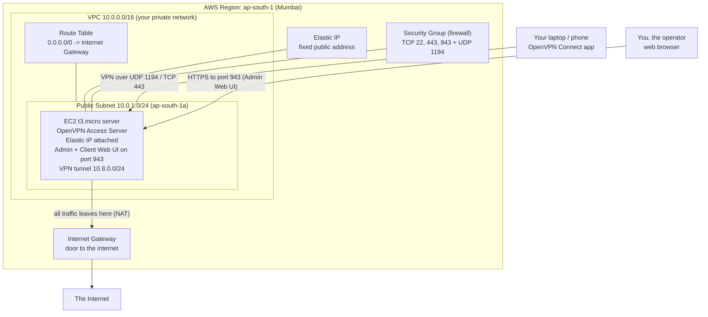

# OpenVPN on AWS — Browser-First (UI) Setup

A click-by-click guide for setting up a working OpenVPN server on AWS **using only your web
browser**. This guide is written for people who have **never used Linux, a command line, or any
automation tools** and would much rather click buttons in a web page than type commands.

To make that possible, this guide launches **OpenVPN Access Server** from the AWS Marketplace.
Access Server is a version of OpenVPN that comes with two **web pages** built in:

- an **Admin Web UI** where you configure the server and create users, and
- a **Client Web UI** where each user logs in and downloads their personal VPN file.

You will spend almost the entire setup pointing and clicking in the AWS Console and in those two web
pages. There is exactly **one** short terminal step (retrieving the very first admin password), and
this guide shows you how to avoid even that if you want to.

> **New to all of this?** That is exactly who this guide is for. Read top to bottom, follow each
> step in order, and do not skip the cost and cleanup sections at the end so you do not get a
> surprise bill.

---

## Table of Contents

- [Architecture Overview](#architecture-overview)
  - [Why This Differs From The Automated Deployment](#why-this-differs-from-the-automated-deployment)
- [AWS Region Selection](#aws-region-selection)
- [Create VPC](#create-vpc)
- [Create Public Subnet](#create-public-subnet)
- [Create Internet Gateway](#create-internet-gateway)
- [Create Route Table](#create-route-table)
- [Create Security Group](#create-security-group)
- [Launch OpenVPN Server](#launch-openvpn-server)
- [Allocate Elastic IP](#allocate-elastic-ip)
- [Access OpenVPN Web UI](#access-openvpn-web-ui)
- [Initial Setup Wizard](#initial-setup-wizard)
  - [Minimal Required Commands](#minimal-required-commands)
- [Create VPN User](#create-vpn-user)
- [Download VPN Profile](#download-vpn-profile)
- [Connect VPN Client](#connect-vpn-client)
- [Validate Connectivity](#validate-connectivity)
- [Troubleshooting](#troubleshooting)
- [Cost Awareness](#cost-awareness)
- [Cleanup and Resource Deletion](#cleanup-and-resource-deletion)

---

## Architecture Overview

You are going to build a small, private network in AWS that contains a single server. That server
runs OpenVPN Access Server. Your laptop or phone connects to it over the internet, and once
connected, all of your internet traffic travels through the server in AWS instead of going out
directly from your home or office network.

Here is the whole picture. Each box is something you will create in this guide.



In plain words:

- The **VPC** (`10.0.0.0/16`) is your own private slice of the AWS network.
- The **public subnet** (`10.0.1.0/24`) is the part of that network that is allowed to reach the
  internet. Your server lives here.
- The **Internet Gateway** and **Route Table** are what let the server talk to the internet.
- The **Security Group** is the firewall that decides which ports are open.
- The **Elastic IP** is a permanent public address so your server's address never changes.
- The **VPN tunnel** (`10.8.0.0/24`) is the range of private addresses handed out to connected
  devices. When you connect, your device gets an address like `10.8.0.2`.
- DNS servers `8.8.8.8` and `8.8.4.4` (Google's public DNS) are pushed to your device so websites
  resolve correctly while connected.
- **Full-tunnel** means *all* of your traffic goes through the VPN, not just some of it.

### Why This Differs From The Automated Deployment

This repository also contains an **automated** deployment (in the `iac/` folder) that builds the
same VPN without any clicking. This UI-first guide is deliberately different in one important way,
but identical in many others.

**DIFFERENT — the software running on the server:**

- This guide installs **OpenVPN Access Server** from the AWS Marketplace. It has a friendly
  **web UI** for everything. It is **free for up to 2 connected devices at the same time**; beyond
  that you buy connection licenses from OpenVPN. This is the easy, browser-friendly path.
- The automated deployment installs **OpenVPN Community Edition** instead. That version is
  **completely free with unlimited connections**, but it has **no web UI at all** — it is configured
  entirely from the Linux command line using tools like easy-rsa and systemd. That is powerful but
  not beginner-friendly, which is exactly why this separate UI guide exists.

**SAME — the AWS networking around the server:**

| Item | Value (identical in both paths) |
|---|---|
| Region | `ap-south-1` (Mumbai) |
| Availability Zone | `ap-south-1a` |
| VPC network | `10.0.0.0/16` |
| Public subnet | `10.0.1.0/24` |
| Internet Gateway + Route Table | yes (`0.0.0.0/0` to the gateway) |
| Server size | `t3.micro` |
| Public address | an Elastic IP |
| VPN data port | **UDP 1194** |
| VPN address range | `10.8.0.0/24` |
| DNS pushed to devices | `8.8.8.8`, `8.8.4.4` |
| Routing mode | full-tunnel (all traffic through the VPN, with NAT) |

**EASIER — what becomes point-and-click in this guide:**

- Creating users, downloading their VPN files, turning on full-tunnel routing, setting DNS, and
  changing server settings are all done by **clicking in the Admin Web UI**.
- There is **no** certificate authority to build by hand, **no** server config file to edit, **no**
  automation tools, and **no** command line for day-to-day use.

> The repository's command-line version opens **only UDP 1194 and SSH 22** in its firewall. This UI
> guide needs **more ports open** because the web UIs and the browser-friendly VPN-over-HTTPS feature
> use them. The exact list is in the [Create Security Group](#create-security-group) section.

---

## AWS Region Selection

Everything you build must live in the same region. This guide uses **Asia Pacific (Mumbai),
`ap-south-1`**, to match the rest of the repository.

**Navigation:** AWS Console (top of the page) → the **Region menu** in the top-right corner (it
shows a city name, e.g. "N. Virginia").

**Action:** Click the Region menu and choose **Asia Pacific (Mumbai) ap-south-1**.

**Expected Result:** The Region menu now reads **Asia Pacific (Mumbai)** / `ap-south-1`.

**Validation:** Look at the top-right of every page from now on — it should keep saying
**Mumbai / ap-south-1**. If you ever cannot find a resource you created, the most common reason is
that the region got switched. Check here first.


> **Important:** If your region is set to anything other than `ap-south-1`, all the values in this
> guide still work, but you must stay consistent — pick one region and never change it mid-build.

---

## Create VPC

The VPC is your own private network inside AWS. Think of it as an empty plot of land with a street
address range of `10.0.0.0/16`.

**Navigation:** AWS Console → search for and open **VPC** → left menu **Your VPCs** → **Create VPC**.

**Action:**

1. Under **Resources to create**, choose **VPC only** (we will add the other pieces ourselves so you
   can see how each one works).
2. **Name tag:** type `ovpn-dev-vpc`.
3. **IPv4 CIDR:** type `10.0.0.0/16`.
4. Leave **IPv6** as *No IPv6 CIDR block* and **Tenancy** as *Default*.
5. Click **Create VPC**.
6. Open the new VPC, then choose **Actions → Edit VPC settings** and tick **Enable DNS hostnames**
   (DNS resolution is already on). Click **Save**.

**Expected Result:** A VPC named `ovpn-dev-vpc` with the address range `10.0.0.0/16` and DNS turned
on.

**Validation:** In **Your VPCs**, the new entry shows IPv4 CIDR `10.0.0.0/16` and State **Available**.


---

## Create Public Subnet

A subnet is a smaller slice of the VPC. The **public subnet** is the slice that is allowed to reach
the internet. Your OpenVPN server will live here.

**Navigation:** AWS Console → **VPC** → left menu **Subnets** → **Create subnet**.

**Action:**

1. **VPC ID:** choose `ovpn-dev-vpc`.
2. **Subnet name:** type `ovpn-dev-public-subnet`.
3. **Availability Zone:** choose `ap-south-1a`.
4. **IPv4 subnet CIDR block:** type `10.0.1.0/24`.
5. Click **Create subnet**.
6. Select the new subnet, then choose **Actions → Edit subnet settings** and tick **Enable
   auto-assign public IPv4 address**. Click **Save**.

**Expected Result:** A subnet `ovpn-dev-public-subnet` with range `10.0.1.0/24` in `ap-south-1a`,
configured to give its servers a public address automatically.

**Validation:** In **Subnets**, the entry shows CIDR `10.0.1.0/24`, Zone `ap-south-1a`, and
**Auto-assign public IPv4 = Yes**.


> **Optional — private subnet:** The repository also models a **private subnet** `10.0.2.0/24` plus a
> NAT Gateway, to show a more realistic company network. For this browser-first VPN you do **not**
> need it, and skipping it saves about $45/month. If you want to add it later for learning, create a
> second subnet `10.0.2.0/24` (same zone, auto-assign public IPv4 **off**) and a NAT Gateway — but it
> is entirely optional and not used anywhere else in this guide.

---

## Create Internet Gateway

The Internet Gateway is the door between your VPC and the public internet. Without it, your server
could not be reached and could not browse out.

**Navigation:** AWS Console → **VPC** → left menu **Internet gateways** → **Create internet
gateway**.

**Action:**

1. **Name tag:** type `ovpn-dev-igw`.
2. Click **Create internet gateway**.
3. On the next screen (or from the list, using **Actions → Attach to VPC**), choose **Attach to VPC**
   and select `ovpn-dev-vpc`. Click **Attach internet gateway**.

**Expected Result:** An Internet Gateway named `ovpn-dev-igw` whose **State** is **Attached** to
`ovpn-dev-vpc`.

**Validation:** In **Internet gateways**, the entry shows **State = Attached** and the VPC column
shows `ovpn-dev-vpc`.


---

## Create Route Table

A route table is a set of signposts that tells traffic where to go. We need one signpost that says:
"to reach anywhere on the internet (`0.0.0.0/0`), go through the Internet Gateway."

**Navigation:** AWS Console → **VPC** → left menu **Route tables** → **Create route table**.

**Action:**

1. **Name:** type `ovpn-dev-public-rt`.
2. **VPC:** choose `ovpn-dev-vpc`.
3. Click **Create route table**.
4. Select the new route table → **Routes** tab → **Edit routes** → **Add route**:
   - **Destination:** `0.0.0.0/0`
   - **Target:** choose **Internet Gateway**, then `ovpn-dev-igw`.
   - Click **Save changes**.
5. Go to the **Subnet associations** tab → **Edit subnet associations** → tick
   `ovpn-dev-public-subnet` → **Save associations**.

**Expected Result:** A route table `ovpn-dev-public-rt` that sends all internet-bound traffic to the
Internet Gateway, and is attached to your public subnet.

**Validation:** On the **Routes** tab you should see two routes: a `10.0.0.0/16` "local" route (added
automatically) and `0.0.0.0/0` pointing to `ovpn-dev-igw`. The **Subnet associations** tab lists
`ovpn-dev-public-subnet`.


---

## Create Security Group

A security group is the server's firewall. It decides which incoming connections are allowed. For
OpenVPN Access Server we open a few specific ports.

> **Why more ports than the command-line version?** The automated repo only opens **UDP 1194** (the
> VPN) and **SSH 22**. Access Server additionally serves its **web UIs on port 943** and supports
> **VPN-over-HTTPS on port 443**, which is great for restrictive networks (cafes, hotels) that block
> UDP. So this guide opens four inbound ports.

**Navigation:** AWS Console → **EC2** → left menu **Network & Security → Security Groups** →
**Create security group**.

**Action:**

1. **Security group name:** type `ovpn-dev-openvpn-sg`.
2. **Description:** type `OpenVPN Access Server - web UI and VPN`.
3. **VPC:** choose `ovpn-dev-vpc`.
4. Under **Inbound rules**, click **Add rule** for each row in the table below.
5. Leave the default **Outbound rule** (All traffic to `0.0.0.0/0`) as is.
6. Click **Create security group**.

**Inbound rules to add:**

| Type | Protocol | Port | Source | What it is for |
|---|---|---|---|---|
| SSH | TCP | `22` | **My IP** (your address only) | One-time admin password setup; keep restricted |
| Custom TCP | TCP | `943` | `0.0.0.0/0` | Admin Web UI and Client Web UI |
| HTTPS | TCP | `443` | `0.0.0.0/0` | Secure web access + VPN-over-TCP (works on locked-down networks) |
| Custom UDP | UDP | `1194` | `0.0.0.0/0` | The main, fast VPN connection |

> **Security warning:** For the **SSH (port 22)** row, do **not** use `0.0.0.0/0`. In the Source
> field choose **My IP** so only your current address can reach SSH. SSH is needed only briefly (see
> [Minimal Required Commands](#minimal-required-commands)); after setup you may remove this rule
> entirely.

**Expected Result:** A security group `ovpn-dev-openvpn-sg` with four inbound rules (22 from your IP;
943, 443, and UDP 1194 from anywhere) and all outbound traffic allowed.

**Validation:** Open the security group → **Inbound rules** tab and confirm all four rules are
present and that port 22's source is your `/32` address, not `0.0.0.0/0`.


---

## Launch OpenVPN Server

Now you launch the actual server from the **AWS Marketplace**, where OpenVPN publishes a ready-made
image with Access Server already installed.

**Navigation:** AWS Console → **EC2** → **Instances** → **Launch instances**. In the **Application
and OS Images** search box, type `OpenVPN Access Server` and open the **AWS Marketplace AMIs** tab.

**Action:**

1. **Name:** type `ovpn-dev-openvpn`.
2. **AMI:** find **OpenVPN Access Server** (published by OpenVPN Inc.) and click **Select**. If a
   subscription pop-up appears, click **Subscribe now** / **Continue** — the software itself is free
   for 2 connections; you pay only for the AWS server time. Accept the terms to continue.
3. **Instance type:** choose `t3.micro`.
4. **Key pair:** choose **Create new key pair**, name it `ovpn-admin`, type **RSA**, format
   **.pem**, and click **Create key pair**. Your browser downloads `ovpn-admin.pem` — keep this file
   safe; it is your emergency way into the server. (If you already created this key pair, just
   select it.)
5. **Network settings → Edit:**
   - **VPC:** `ovpn-dev-vpc`
   - **Subnet:** `ovpn-dev-public-subnet`
   - **Auto-assign public IP:** **Enable**
   - **Firewall (security groups):** **Select existing security group** → `ovpn-dev-openvpn-sg`
6. **Configure storage:** leave the default root volume; the recommended setup is **gp3, 8 GiB**.
7. *(Optional but recommended — avoids the one terminal step)* Expand **Advanced details → User
   data** and paste the snippet from [Minimal Required Commands](#minimal-required-commands) to set
   the admin password automatically at first boot.
8. Click **Launch instance**.

**Expected Result:** An instance named `ovpn-dev-openvpn` that moves from **Pending** to **Running**
within a minute or two, built from the OpenVPN Access Server Marketplace image.

**Validation:** In **EC2 → Instances**, `ovpn-dev-openvpn` shows **Instance state = Running**,
**Instance type = t3.micro**, and a **Public IPv4 address**. Wait until **Status check** shows
**2/2 checks passed** before continuing.


> **Cost note:** Charges begin the moment the instance is **Running**, whether or not anyone is
> connected. See [Cost Awareness](#cost-awareness) and tear it down when you are done.

---

## Allocate Elastic IP

By default, a server's public address can change if it is ever stopped and started. An **Elastic IP**
gives it a permanent address so your saved VPN profiles never break.

**Navigation:** AWS Console → **EC2** → left menu **Network & Security → Elastic IPs** → **Allocate
Elastic IP address**.

**Action:**

1. Leave **Network border group** at the default (it shows `ap-south-1`) and click **Allocate**.
2. Select the new address → **Actions → Associate Elastic IP address**.
3. **Resource type:** **Instance** → choose `ovpn-dev-openvpn` → click **Associate**.
4. *(Optional)* Add a **Name** tag `ovpn-dev-openvpn-eip` so it is easy to find later.
5. **Write down this address.** This is your `<EIP>` — the public address you will type into the
   browser and into the VPN app.

**Expected Result:** A fixed public address is permanently associated with `ovpn-dev-openvpn`.

**Validation:** On the **Elastic IPs** page, the address shows **Associated instance =
ovpn-dev-openvpn**. The instance's **Public IPv4 address** now equals this Elastic IP.


> **Cost note:** An Elastic IP that is **associated with a running instance** is normally free, but
> AWS charges a small hourly fee for any Elastic IP that is **allocated** (roughly $3.60/month).
> Always **release** it during cleanup so it does not keep billing after you delete the server.

---

## Access OpenVPN Web UI

OpenVPN Access Server provides two web pages, both reached at your Elastic IP on port **943**:

- **Admin Web UI:** `https://<EIP>:943/admin` — where **you** configure the server and manage users.
- **Client Web UI:** `https://<EIP>:943/` — where **each user** logs in to download their VPN file.

**Navigation:** Open a web browser and go to **`https://<EIP>:943/admin`** (replace `<EIP>` with the
Elastic IP you wrote down).

**Action:**

1. Your browser will show a **security/certificate warning**. This is expected — Access Server uses a
   self-signed certificate by default. Click **Advanced → Proceed/Continue** to the site.
2. At the login screen, sign in with username **`openvpn`** and the admin password. (Where that
   password comes from is covered in the [Initial Setup Wizard](#initial-setup-wizard) below.)

**Expected Result:** The OpenVPN Access Server **Admin login page** appears, then the Admin
dashboard after you log in.

**Validation:** You can see the Admin dashboard with a left-hand menu containing **Configuration**,
**User Management**, **Status**, etc.


> **Tip:** The certificate warning only appears because the server uses its own self-signed
> certificate. It is safe to proceed for a learning lab. (Production setups install a real
> certificate so the warning disappears.)

---

## Initial Setup Wizard

The first time you open the Admin Web UI, Access Server walks you through a short **browser wizard**.
Before you can log in, though, you need the **admin password**.

### Minimal Required Commands

This is the **only** part of the entire guide that may involve a terminal, and only if you did **not**
paste the user-data snippet during launch. You need it because, for security, the Marketplace image
does **not** ship with a fixed, public default password — you set your own on first boot.

**Best option — set the password automatically at launch (no terminal at all).** If you expanded
**Advanced details → User data** in the launch step, paste exactly this and you can skip the SSH step
entirely:

```text
admin_user=openvpn
admin_pw=ChangeMe-Strong-Pass-123!
```

> Replace `ChangeMe-Strong-Pass-123!` with a strong password of your own. This tells Access Server
> to create an admin account named `openvpn` with that password the first time it starts. After it
> boots, just go straight to `https://<EIP>:943/admin` and log in.

**Fallback option — set the password once over SSH.** If you did not use user-data, do this single
one-time step. It connects to the server and runs the built-in tool that sets the admin password. You
will not need the terminal again after this.

1. Open the **EC2 console → Instances → select `ovpn-dev-openvpn` → Connect → SSH client** tab and
   copy the example command, or use any SSH client. The login user for this image is **`openvpn`**
   (or `openvpnas`), and the key is the `ovpn-admin.pem` file you downloaded:

   ```text
   ssh -i ovpn-admin.pem openvpn@<EIP>
   ```

2. Once connected, run the built-in password tool and follow its prompt to type a new admin password:

   ```text
   sudo passwd openvpn
   ```

   *(On some image versions the account is `openvpnas`; if so, run `sudo passwd openvpnas`. The
   on-screen welcome banner tells you the exact admin username.)*

3. Type your new password twice, then close the terminal. That is the entire command-line portion of
   this guide.

> **Why this exists:** AWS Marketplace images cannot ship with a known default password, or every
> copy of the image would be insecure. Setting it yourself — ideally via user-data so you never touch
> a terminal — keeps your server private from the very first second.

**Now finish the browser wizard:**

**Navigation:** browser → `https://<EIP>:943/admin` → log in as `openvpn` with the password you set.

**Action:** Work through the wizard screens, accepting the defaults except where noted to match this
guide:

1. **Agree** to the license terms.
2. **VPN Settings / Routing:** confirm **"Should client Internet traffic be routed through the
   VPN?" = Yes**. This turns on **full-tunnel** (all traffic through the VPN), matching this guide.
3. **DNS Settings:** choose to **push specific DNS servers** and enter **`8.8.8.8`** and
   **`8.8.4.4`**.
4. **Network Settings:** confirm the **Hostname or IP Address** shows your **`<EIP>`** so generated
   profiles point clients at the right address. Leave the protocols as the default (UDP for speed,
   with TCP 443 as a fallback).
5. Save / apply. Access Server will reconfigure itself (this takes a few seconds).

**Expected Result:** The Admin dashboard is fully configured: full-tunnel on, DNS `8.8.8.8` /
`8.8.4.4` pushed, and the public address set to your Elastic IP.

**Validation:** In the Admin UI under **Configuration → VPN Settings**, "Routing" shows that client
Internet traffic **is** routed through the VPN, and the DNS section lists `8.8.8.8` and `8.8.4.4`.


---

## Create VPN User

Each person (or device) that connects gets their own username and their own VPN profile. You create
users entirely in the Admin Web UI.

**Navigation:** Admin Web UI (`https://<EIP>:943/admin`) → left menu **User Management → User
Permissions**.

**Action:**

1. In the **New Username** box, type a name, for example `admin_user` (this matches the default user
   name used elsewhere in the repository).
2. Click **More Settings** next to that user to expand it.
3. Set a **password** for the user in the **Local Password** field (Access Server uses local password
   login by default).
4. Leave **Allow Auto-login** off for a normal, password-protected user (turn it on only if you want
   a profile that connects without a prompt).
5. Click **Save Settings**, then click **Update Running Server** at the top to apply.

**Expected Result:** A user named `admin_user` appears in the **User Permissions** list with a
password set.

**Validation:** The user is listed under **User Management → User Permissions**, and you applied the
change with **Update Running Server** (no pending-changes banner remains).


> **Free-tier reminder:** Access Server is free for **2 simultaneous connections**. You can create
> many users, but only two can be connected at the same moment before you need paid licenses.

---

## Download VPN Profile

A **VPN profile** is a small `.ovpn` file that contains everything your device needs to connect.
Users download their own profile from the **Client Web UI**.

**Navigation:** open a browser and go to the **Client Web UI** at **`https://<EIP>:943/`** (note:
**no** `/admin` on the end).

**Action:**

1. Log in with the user's credentials, for example username `admin_user` and the password you set.
2. After login you will see download options. Choose **"Yourself (user-locked profile)"** to download
   a profile tied to this specific user.
3. Click to download the **`.ovpn`** file (sometimes called the "OpenVPN profile" or "client.ovpn").
   Save it somewhere you can find it.

**Expected Result:** A file like `client.ovpn` (or `admin_user.ovpn`) is downloaded to your device.

**Validation:** Open the file in a plain text viewer if curious — near the top you should see a line
beginning with `remote <EIP>` and a port (`1194` or `443`), confirming it points at your server.


> **Tip:** You can also download the **OpenVPN Connect** app directly from this same Client Web UI
> page on most platforms, which bundles the profile for you automatically.

---

## Connect VPN Client

Now connect a device using the free **OpenVPN Connect** app and the profile you downloaded.

**Navigation:** install **OpenVPN Connect** for your device:

- **Windows / macOS:** download from `https://openvpn.net/client/` (or the Client Web UI page).
- **iPhone / iPad:** the **OpenVPN Connect** app from the App Store.
- **Android:** the **OpenVPN Connect** app from the Google Play Store.

**Action:**

1. Open **OpenVPN Connect**.
2. Choose **Import Profile → File** (or **Upload File**) and select the `.ovpn` file you downloaded.
   (On phones you can also use the **URL** option and enter `https://<EIP>:943/`, then log in.)
3. Enter the user's **username and password** if prompted, and optionally tick **Save password**.
4. Toggle the connection **On**.

**Expected Result:** The app shows a **Connected** status, usually with a green indicator and the
amount of data transferred.

**Validation:** The app displays your assigned VPN address (something in the `10.8.0.0/24` range,
e.g. `10.8.0.2`) and a connected/active state.


---

## Validate Connectivity

Let's confirm the VPN is actually carrying your traffic. None of this needs a terminal — a web
browser is enough.

**Action and checks:**

1. **Your public IP changed.** With the VPN **off**, visit `https://checkip.amazonaws.com` (or search
   "what is my IP") and note the address. Turn the VPN **on** and reload — the address should now be
   your server's **Elastic IP (`<EIP>`)**. That proves your traffic is exiting through AWS
   (full-tunnel is working).
2. **DNS works.** While connected, browse to any normal website (e.g. `https://www.wikipedia.org`).
   It should load normally, proving the pushed DNS servers `8.8.8.8` / `8.8.4.4` are resolving names
   inside the tunnel.
3. **Admin status page.** In the Admin Web UI go to **Status → Current Users**; your connected device
   should be listed with its `10.8.0.x` address.

**Expected Result:** With the VPN on, the internet still works and your visible public address is the
server's Elastic IP.

**Validation checklist:**

- [ ] Public IP with VPN on equals your `<EIP>`.
- [ ] Websites load normally (DNS resolves).
- [ ] The connected device appears under **Status → Current Users** in the Admin UI.


---

## Troubleshooting

| Symptom | Likely cause | Fix |
|---|---|---|
| Browser cannot reach `https://<EIP>:943/admin` | Port 943 not open, or wrong address | Confirm the **security group** has an inbound rule for **TCP 943** from `0.0.0.0/0`; confirm you are using the **Elastic IP**, not an old public IP |
| Certificate warning in the browser | Normal — self-signed certificate | Click **Advanced → Proceed**; it is safe for a lab |
| Cannot log in to the Admin UI | Admin password not set, or wrong user | Re-do [Minimal Required Commands](#minimal-required-commands); the admin user is usually `openvpn` (check the SSH welcome banner) |
| VPN app connects but websites do not load | DNS or full-tunnel not configured | In the Admin UI confirm DNS `8.8.8.8`/`8.8.4.4` is pushed and that "route Internet traffic through the VPN" is **Yes**; click **Update Running Server** |
| Connects on home Wi-Fi but not at a cafe/hotel | UDP 1194 blocked by that network | Access Server falls back to **TCP 443** automatically; make sure **TCP 443** is open in the security group |
| "Only 2 connections allowed" message | Free tier limit reached | Disconnect another device, or buy connection licenses from OpenVPN |
| Public IP did not change after connecting | Full-tunnel is off | Admin UI → **Configuration → VPN Settings** → set routing of client Internet traffic to **Yes**; **Update Running Server**; reconnect |
| Instance unreachable right after launch | Still booting / status checks not done | Wait until **EC2 → Status check = 2/2 passed**, then retry |

> **Most common mistake:** the AWS Console region quietly switched away from `ap-south-1`, so your
> resources "disappear." Check the [region selector](#aws-region-selection) first whenever something
> is missing.

---

## Cost Awareness

This lab is inexpensive but **not free unless you tear it down**. Charges accrue while resources
exist, even when you are not connected.

| Resource | Approximate cost | Notes |
|---|---|---|
| EC2 `t3.micro` (running) | ~$7.50/month | May be covered by the AWS **Free Tier** for the first 12 months on eligible accounts |
| Elastic IP (allocated) | ~$3.60/month | Free *only* while associated with a running instance; charged if left allocated/unused |
| EBS root volume (gp3, 8 GiB) | ~$0.70/month | Storage for the server's disk |
| OpenVPN Access Server software | **Free for 2 connections** | Beyond 2 simultaneous connections, you buy per-connection licenses from OpenVPN |
| NAT Gateway | **Not used in this guide** | Only needed if you add the optional private subnet (~$45/month — avoid for a VPN-only lab) |

**Rough total for this UI path: about $8–12/month** (or close to free on the Free Tier), as long as
you do **not** add the optional private subnet and NAT Gateway.

> **Always tear down when you are finished.** Follow [Cleanup and Resource
> Deletion](#cleanup-and-resource-deletion) to stop all charges.

---

## Cleanup and Resource Deletion

Delete resources **in this order** so AWS does not block you with a "DependencyViolation" error (you
cannot delete a thing while another thing still depends on it). Everything here is done in the
browser.

**1. Delete VPN users (Admin Web UI).**
Admin Web UI → **User Management → User Permissions** → remove each user (e.g. `admin_user`) → click
**Update Running Server**. This cleanly revokes access first.

**2. Release the Elastic IP.**
EC2 → **Network & Security → Elastic IPs** → select your address → **Actions → Release Elastic IP
address** → confirm. *(Releasing stops the hourly Elastic IP charge.)*

> Releasing the Elastic IP before terminating the instance is fine and prevents a lingering, billable
> unassociated address after the instance is gone.

**3. Terminate the EC2 instance.**
EC2 → **Instances** → select `ovpn-dev-openvpn` → **Instance state → Terminate (delete) instance** →
confirm. Wait until its state is **Terminated**. The attached 8 GiB EBS volume is deleted with it by
default.

**4. Delete the Security Group.**
EC2 → **Network & Security → Security Groups** → select `ovpn-dev-openvpn-sg` → **Actions → Delete
security group**. *(This only succeeds after the instance is fully terminated, since the instance
used this group.)*

**5. Delete the Route Table.**
VPC → **Route tables** → select `ovpn-dev-public-rt` → first **Subnet associations → Edit → untick**
the subnet and save, then **Actions → Delete route table**. *(The main/default route table for the
VPC is removed automatically with the VPC and cannot be deleted on its own — that is normal.)*

**6. Detach and delete the Internet Gateway.**
VPC → **Internet gateways** → select `ovpn-dev-igw` → **Actions → Detach from VPC** → confirm, then
**Actions → Delete internet gateway**.

**7. Delete the Subnet(s).**
VPC → **Subnets** → select `ovpn-dev-public-subnet` → **Actions → Delete subnet**. (If you created
the optional private subnet and NAT Gateway, delete the **NAT Gateway** first and **release its
Elastic IP**, then delete `ovpn-dev-private-subnet`.)

**8. Delete the VPC.**
VPC → **Your VPCs** → select `ovpn-dev-vpc` → **Actions → Delete VPC**. AWS may offer to remove
remaining attached pieces with it — review and confirm.

**9. Cancel the Marketplace subscription.**
AWS Console → **AWS Marketplace → Manage subscriptions** → find **OpenVPN Access Server** →
**Actions → Cancel subscription**. This stops any software-related billing tied to the Marketplace
listing.

**10. Verify no ongoing AWS charges.**
Confirm everything is gone:

- **EC2 → Instances:** no instance named `ovpn-dev-openvpn` (or it shows **Terminated**).
- **EC2 → Elastic IPs:** your address no longer appears (released).
- **VPC → Your VPCs:** `ovpn-dev-vpc` is gone.
- **Billing → Bills / Cost Explorer:** check the current month for unexpected EC2, EIP, or VPC
  charges.

**Cleanup checklist:**

- [ ] All VPN users removed in the Admin UI.
- [ ] Elastic IP released (not just disassociated).
- [ ] EC2 instance `ovpn-dev-openvpn` terminated; its EBS volume gone.
- [ ] Security group `ovpn-dev-openvpn-sg` deleted.
- [ ] Route table `ovpn-dev-public-rt` deleted.
- [ ] Internet Gateway `ovpn-dev-igw` detached and deleted.
- [ ] Subnet(s) deleted (and NAT Gateway, if you added the optional one).
- [ ] VPC `ovpn-dev-vpc` deleted.
- [ ] Marketplace subscription for OpenVPN Access Server cancelled.
- [ ] Billing dashboard shows no ongoing VPN-related charges.

> **Done.** With all of the above deleted and the subscription cancelled, this lab stops costing you
> anything.
